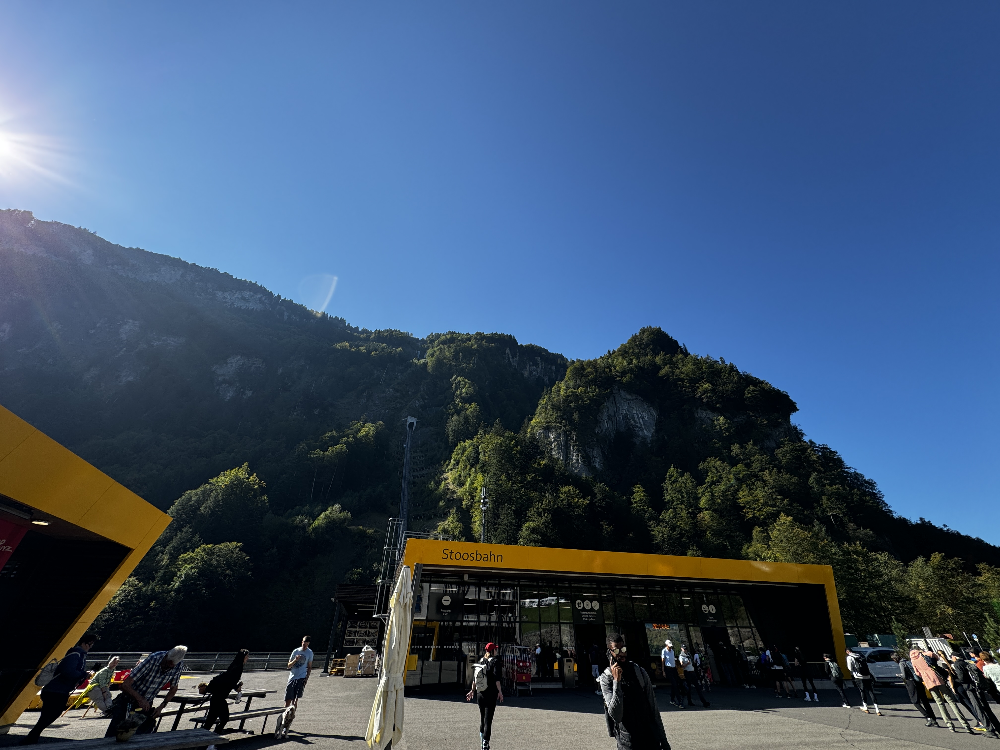
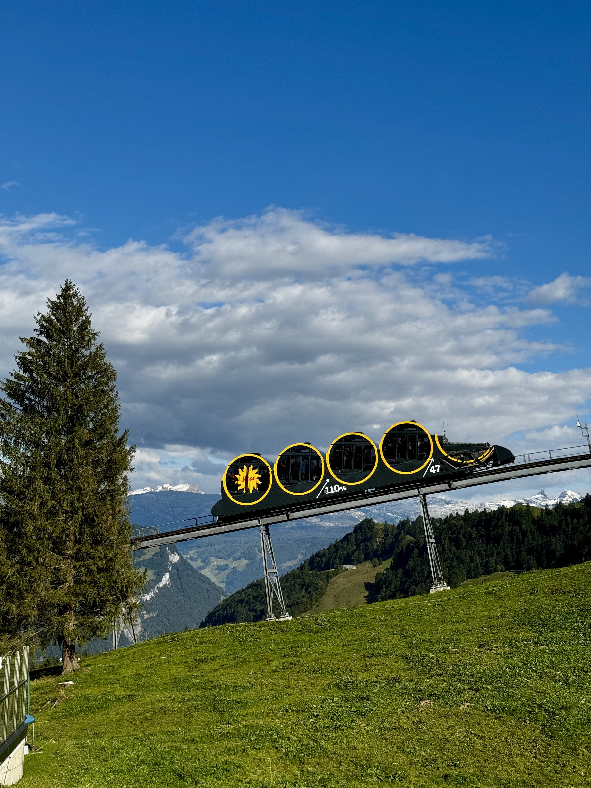
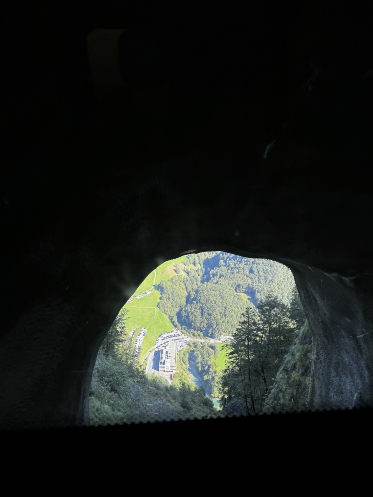
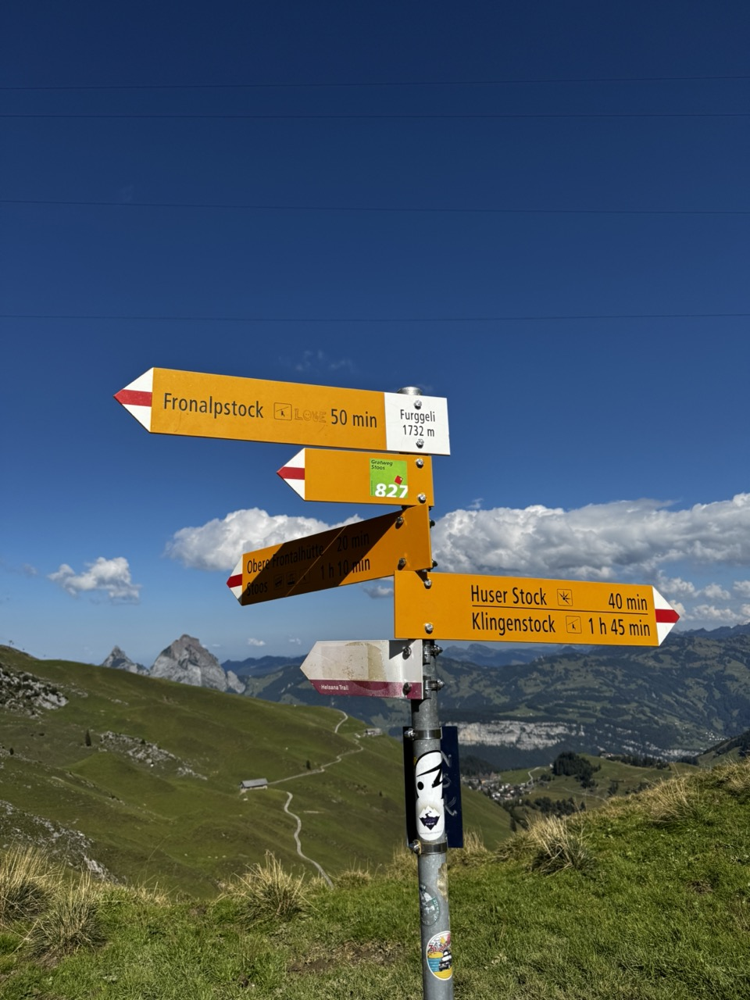
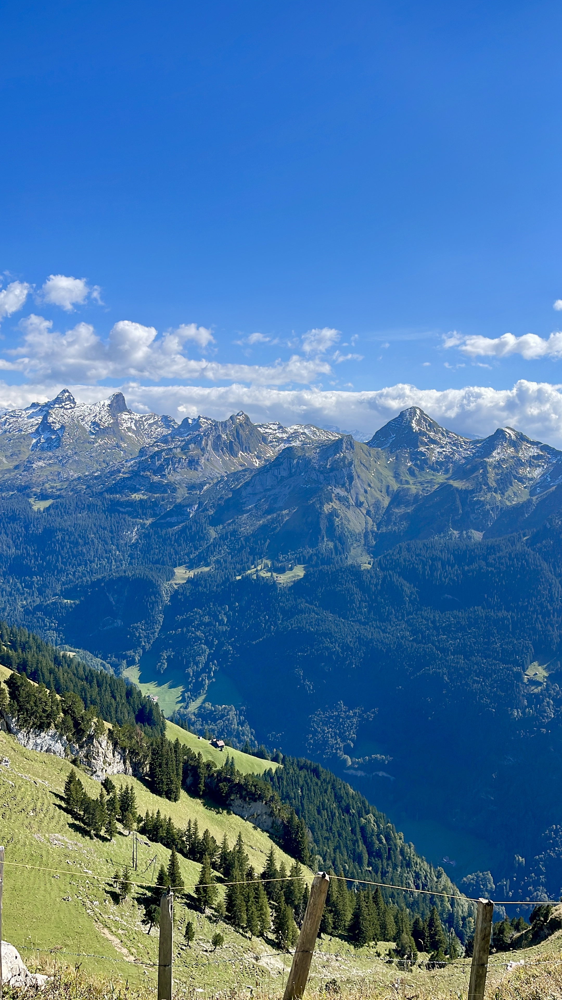

The Stoos trail in Switzerland is a scenic alpine hike known for its sweeping views of the Swiss Alps and Lake Lucerne. Starting with a ride on the world's steepest funicular, this trail offers both adventure and stunning natural beauty.

&nbsp;

Enjoy every single moment in **Stoos**; you will fall in love.

## ✈ Schwyz, Stoos

You will arrive in the city of Schwyz, nestled beneath the mountain, where your adventure begins. The village of Stoos sits above Schwyz, and from there, you can purchase your funicular **ticket** on-site, but I recommend buying it online to skip the line and head straight to the funicular for a smoother experience.

If you travel **by car**, you can find parking spots available for around 1 CHF per hour.

Another option is to travel by train **from Zurich**, which takes around 1 hour and 30 minutes.

&nbsp;

&nbsp;

[Stoos, Schwyz](https://www.google.com/maps/place/6433+Stoos/@46.9797563,8.6566496,15z/data=!4m15!1m8!3m7!1s0x47854f75c3a3a779:0xe3a15d4f8070c905!2s6433+Stoos!3b1!8m2!3d46.9797573!4d8.6669493!16s%2Fm%2F065_c3n!3m5!1s0x47854f75c3a3a779:0xe3a15d4f8070c905!8m2!3d46.9797573!4d8.6669493!16s%2Fm%2F065_c3n?entry=ttu&g_ep=EgoyMDI0MDkyMy4wIKXMDSoASAFQAw%3D%3D)

[Stoos Oficial Site TICKETS](https://www.stoos.ch/en/pages/peak-experience-ticket-day-ticket)

[All oficial information about the Opening hours](https://www.stoos.ch/en/pages/timetables)

&nbsp;

### ✈ Hiking

The hike begins after taking the world's steepest funicular, where you can follow the trail **from Klingenstock to Fronalpstock**, though it can be done in the opposite direction as well.

I highly recommend starting this way, as you'll be rewarded with stunning views of **Lake Lucerne** at a certain point along the hike, making the experience even more enjoyable.

&nbsp;

&nbsp;

<!-- 
 -->

<!--  -->

[Interactive Map](https://stoos-muotatal.ch/en/open-facilities/)

<!-- Free

Mon-Fri:10:30 am to 6:00 pm, Sat:10:00 am to 6:00 pm, Sun: 11:00 am to 5:00 pm. -->

&nbsp;

### ✈Funicular train

The Stoos funicular, known as the world's steepest funicular railway, is an engineering marvel that provides a thrilling ascent to the village of Stoos from the valley below. Opened in 2017, this funicular features a remarkable incline of up to 110% (or 47 degrees), making it a unique attraction for visitors.

&nbsp;

The journey begins in the town of Schwyz, where passengers board the funicular for a scenic ride that takes about five minutes. As it climbs, the funicular offers stunning views of the surrounding landscapes, including the picturesque Lake Lucerne and the majestic peaks of the Swiss Alps. The design of the funicular is notable for its innovative technology, which allows it to maintain stability and safety on such a steep gradient.

&nbsp;

The funicular can carry up to 100 passengers at a time, making it accessible for both tourists and locals. The ride is not just a means of transportation but an experience in itself, as the cabin glides smoothly up the slope, providing breathtaking vistas at every turn.

&nbsp;

### ✈ Hiking tips

<!--  -->

&nbsp;

☞ Wear **comfortable clothes and shoes**, and check the weather as much as possible, since bad weather could be an issue.

☞ **Pets** are allowed but must be kept on a leash.

☞ This hike is considered **moderate**—it's not difficult, but be prepared for some steep sections.

&nbsp;

The Stoos trail, located in the charming Schwyz region of Switzerland, is a must-visit destination for nature lovers and adventure enthusiasts. The journey begins in the village of Stoos, which is accessed by the world’s steepest funicular, providing a unique experience right from the start.

&nbsp;

As you progress along the trail, you are surrounded by stunning landscapes that include vast green fields, dense forests, and majestic alpine mountains. The trail connects the peaks of Klingenstock and Fronalpstock, allowing hikers to explore various panoramic views. At several points, Lake Lucerne appears below, reflecting the surrounding mountains and creating a breathtaking sight.

&nbsp;

The environment is serene and tranquil, making it perfect for a getaway from the hustle and bustle of the city. Visitors can enjoy resting areas along the trail, where they can have a picnic or simply relax while admiring the natural beauty. The weather in the region can vary, so it's advisable to be prepared for rapid changes.

&nbsp;

Moreover, the Stoos trail is considered moderate, making it suitable for hikers of varying experience levels, from beginners to more experienced trekkers. It’s an excellent opportunity to connect with nature, hike with family, or even bring your pet along (on a leash). The trail offers a memorable experience that combines physical activity, scenic beauty, and the tranquility of the Swiss Alps.

&nbsp;

&nbsp;

###### ✈ More About Switzerland

🙏🏾 **Religion**: The majority of people living in Switzerland are Christians. 34.4 % are Roman Catholic, and 22.5 % Protestant. There are also many other religions represented in Switzerland: 5.4 % Muslim, 2.6 % Orthodox Christians, 0.5 % Buddhist, 0.2% Jewish.

🗣️ **Language**: English, German, French, Italian and Romansh

🤑 **Currency**: Swiss franc (CHF)

&nbsp;

💡 **Travel Tip**:
_See here if you need [luggage storage in Stoos](https://www.nannybag.com/en)._

&nbsp;

<iframe src="https://www.google.com/maps/d/u/0/embed?mid=1BsxIi2kmOwpLjyuDXZ1uOYbi65Gsr3c&ehbc=2E312F" width="640" height="480"></iframe>

&nbsp;

&nbsp;

 <iframe width="500" height="280" src="https://www.youtube.com/embed/Mf-2Wh8SSf0?si=HLdz1ankg1-8Hcn_" title="YouTube video player" frameborder="0" allow="accelerometer; autoplay; clipboard-write; encrypted-media; gyroscope; picture-in-picture; web-share" referrerpolicy="strict-origin-when-cross-origin" allowfullscreen></iframe>

&nbsp;

###### ✈ Tours I recommend

Powered by <a target="_blank" rel="sponsored" href="https://www.getyourguide.com/lucerne-l867/">GetYourGuide</a>

&nbsp;

&nbsp;
