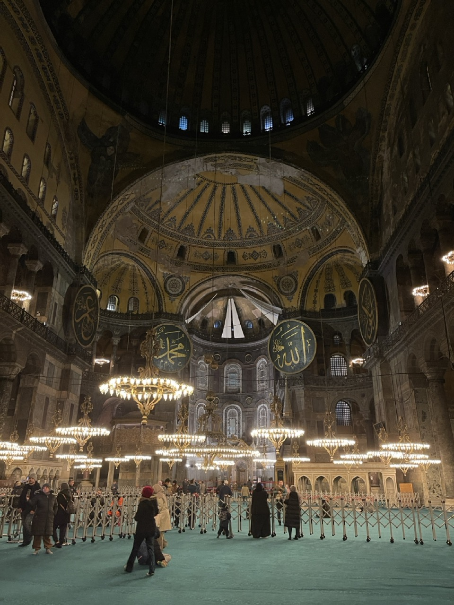
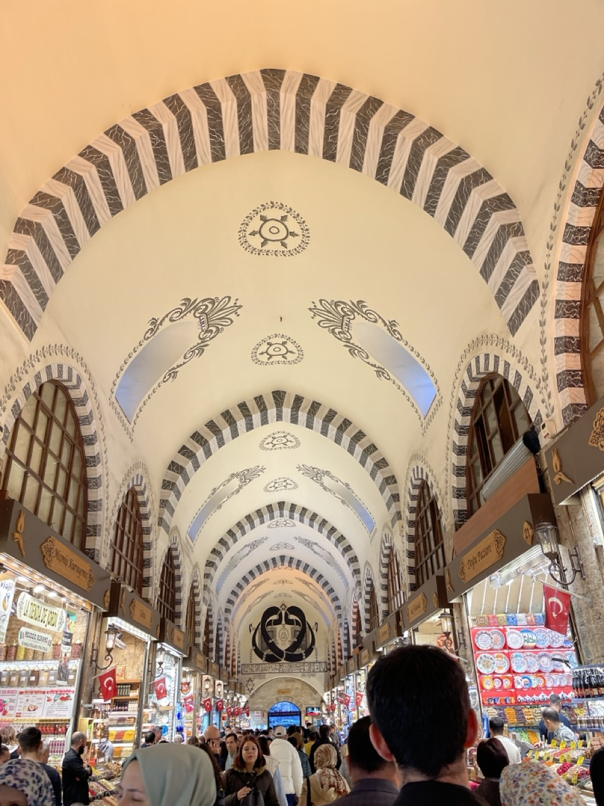
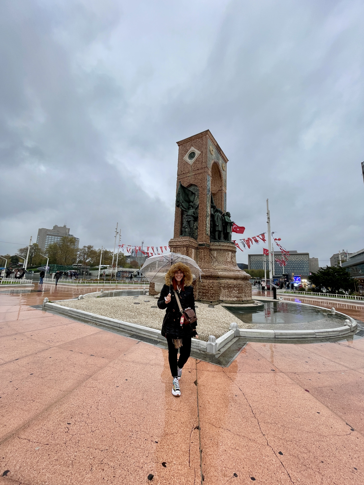

Istanbul is the only transcontinental city in the world. On the western side of the Bosphorus Strait, you are in Europe, but if you cross to the other side, you will be stepping into Asia!

Everything is open on weekends, don't worry about that because it's open until later. Just enjoy your time there.

&nbsp;

Enjoy every single moment in Skopje; you will fall in love.

## ✈ Istanbul Bosphorus Dinner Cruise

&nbsp;

This is a beautiful experience you can have in Istanbul. The boat tour is a great way to see the city at night and to get another perspective of this city. You have to try this because it is not expensive, and you can have so much fun.

Experience a lively cruise along the **Bosphorus Strait**. See the palaces of Ottoman sultans at night and enjoy the view of the European and Asian shores. Indulge in delicious Turkish cuisine for dinner.

&nbsp;

<!--  -->

[Tour - Get Your Guide](https://www.getyourguide.com/istanbul-l56/istanbul-bosphorus-dinner-cruise-with-live-entertainment-t415437/?partner_id=3K1OV70&utm_medium=online_publisher)

€32.50 per person

**Duration:** 3h

&nbsp;

## ✈ Gülhane Park

This is a great place to visit and spend some time, just enjoying the moment. Take a break, capture some videos and photos – you're going to like it.

**Gülhane Park** is one of the largest and most beautiful parks in the city. Thousands of tulips bloom in the park during spring.

&nbsp;

<!--  -->

[Gülhane Park](https://maps.app.goo.gl/NGF6t8Yk6vCp6fjb9)

Free

Open daily

&nbsp;

## ✈ Topkapi Palace

&nbsp;

Certainly, you have to visit the **Topkapi Palace**, as it is one of the most significant places in Istanbul. It is a vast site, so be prepared to spend some time here. If you have to choose where to go and spend money, put the Topkapi Palace at the top of your choices.

&nbsp;

Topkapi is a vast ancient palace (now a museum) for sultans and their families. It houses four grand courtyards with gardens, smaller buildings, a view over the river, and a stunning harem (where the women of the family lived).

&nbsp;

The beautifully decorated Topkapi Palace Harem has 300 rooms, 9 Turkish baths, 2 mosques, and even a hospital. The harem is located in the second courtyard on the left side.

&nbsp;

&nbsp;

&nbsp;

<!--  -->

[Topkapi Palace](https://maps.app.goo.gl/uPReLRq6eyVfCESa8)

<!-- **Combined tickets** -->

&nbsp;

Topkapı Palace + Harem + Hagia Irene= 950 ₺ (32,00 €)

Topkapı Palace + Hagia Irene= 750 ₺  (25,00 €)

&nbsp;

Open daily between 09:00 am - 18:00 pm (Tuesday Closed)

&nbsp;

## ✈ Hagia Sophia

&nbsp;

This mosque is one you have to visit because it is one of the most famous **mosques in Istanbul**. Be aware that there are a lot of people in line trying to visit; it is free, but you have to spend time in line to get there. HOWEVER, I have some news: go to the Hagia Sophia at night around 8 pm because it is empty and there is no line.

&nbsp;

Another thing, women are not allowed to enter without a head covering and full-body attire. Also, men wearing short clothes need to wear additional cover clothes. Remember to take off your shoes; there is a place outside where you can leave your shoes.

&nbsp;

Yes, you can take photos and videos inside the mosque.

&nbsp;

It is a great experience to have and learn about the religion.

It was converted into a mosque from a church in the 15th century. Its unique architecture still holds its mystery, and I guarantee you will have the most exclusive photos as you explore the Hagia Sophia Mosque.

&nbsp;

<!--  -->

[Hagia Sophia](https://maps.app.goo.gl/gKWpieVziKzf8HZr9)

Free

&nbsp;

## ✈ The Blue Mosque

&nbsp;

It's another **mosque** where you can have a different experience. Of course, there is a huge line, so if you really want to go inside, be prepared to reserve some time there in line.

&nbsp;

If you don't mind staying outside, the patio is beautiful and a great place to take some photos. Another thing is, from time to time, they ask everyone to leave the patio because it's time for prayer.

&nbsp;

The Sultan Ahmed Mosque, better known as the Blue Mosque due to the prominent colour of its majestic interior, was built in the early 17th century during the reign of Ahmed I and is among the city's most famous landmarks. Located opposite the Hagia Sophia, the Blue Mosque remains a functional mosque, and visitation is prohibited during prayer times.

&nbsp;

<!--  -->

[Blue Mosque](https://maps.app.goo.gl/VLoDsBkHH1X9GYTN6)

&nbsp;

Free

&nbsp;

08:30-11:30,13:00-14:30,15:30-16:45.

&nbsp;

## ✈ Hippodrome

&nbsp;

The **Hippodrome** is in front of the Blue Mosque, and in the middle, the square is not crowded, allowing you to take nice photos there.

&nbsp;

The Istanbul Hippodrome served as an ancient racetrack where historical chariot races and athletic competitions were held, centrally adorned with the Egyptian Obelisk and other famous columns.

&nbsp;

<!--  -->

[Hippodrome](https://maps.app.goo.gl/pPci7cVnBTvagmRx7)

Free

24/7

&nbsp;

## ✈ Grand Baazar

&nbsp;

The **Grand Bazaar** is really vast; you can get lost inside and on the streets. Part of this place is indoors, but another part is not. Be careful with your belongings as it is crowded, and you don't have control over the people around you. Another point is to be patient with the sellers because they are really insistent, and you can end up buying things you shouldn't.

&nbsp;

The city's Grand Bazaar is the largest covered market in the world.

&nbsp;

Among the largest and oldest covered markets globally, the Grand Bazaar features thousands of shops spread across dozens of streets. It is a destination worth exploring even for those who don't intend to buy anything, as the historical atmosphere of the vast complex is its true appeal. If you are planning to shop, don your bargaining hat and show no mercy.

&nbsp;

<!--  -->

[Grand Baazar](https://maps.app.goo.gl/MUeF5uyYMKkC5AT56)

Free

08:30-19:00

&nbsp;

## ✈ Spice Bazaar or Egyptian Bazar

&nbsp;

Another **bazaar** you have to try; there are a lot of colours and smells, and, of course, it is beautiful as well.

&nbsp;

Smaller than its neighbour, the Grand Bazaar, the Spice Bazaar, also known as the Egyptian Bazaar, was built in the 16th century.

&nbsp;

It features rows of spice vendors displaying their colourful products in large pyramid-like mounds, making it a visual experience as much as a place to buy spices, Turkish delights, and other souvenirs.

&nbsp;

<!--  -->

[Spice Baazar](https://maps.app.goo.gl/JzUpJoUnT4iGiKPu8)

Free

**Open daily between** 08:00 am - 7:30 pm

&nbsp;

## ✈ Yeni Cami Mosque

&nbsp;

You don't need to go inside, but the patio is great, and outside, there is a beautiful building. There is a square in front of the mosque with a lot of birds. You can also have a view of the river; it's a great place with many places to eat and drink.

&nbsp;

New Mosque **'Yeni Camii'**
The New Mosque was the last of the great mosques built by the Ottoman sultans. Its foundation was laid in 1597; however, for various reasons, it was not completed for 66 years.
The construction took an exceptionally long time (work began in 1597) due to funding issues and political unrest.

&nbsp;

The building was finally completed sixty years later by Valide Sultan Turhan Hatice, the mother of Sultan Mehmet IV.

&nbsp;

<!--  -->

[Yeni Cami Mosque](https://maps.app.goo.gl/jzSGZ8mt7LehdHTaA)

Free

&nbsp;

## ✈ Rumeli Fortress

&nbsp;

I had high expectations about it, but unfortunately, it was partially closed. **The fortress** is not close to other places, but you can easily get there by bus.

&nbsp;

UNIQUE EXAMPLE OF OTTOMAN MILITARY ARCHITECTURE

&nbsp;

After the conquest of Istanbul, the Rumeli Fortress lost its strategic importance and became an imperial prison and customs control point.

&nbsp;

Over time, a neighbourhood emerged within the fortress, which began to be used as a residential area. The fortress was damaged by an earthquake in 1509 and later by a fire in the mid-17th century.

&nbsp;

<!--  -->

[Rumeli Fortress](https://maps.app.goo.gl/ajtYoWvSJ5jfrzgu6)

4,30 €

Monday(CLOSED) - Other days 9 am - 5 pm

&nbsp;

## ✈ Galata tower

&nbsp;

At this tower, you can have a view but you can have a moment walking around the narrow streets until that tower.
&nbsp;

Go to the Galata Tower, a medieval stone tower built on a hill overlooking the entire city. To visit the top. Trendy cafes surround the Galata Tower, so you can easily have your breakfast and coffee there.

&nbsp;

After being used as a dungeon for some time in the Ottoman Era, it was converted into a fire lookout tower.

&nbsp;
The tower, which was in ruins in the 1960s, was restored by the municipality of Istanbul and opened for visitation.

&nbsp;

<!--  -->

[Galata tower](https://maps.app.goo.gl/WtzhmGUqEfPkRL4H6)

650 TL - 22,00 €

**Open daily between** 08:30 am - 11:00 pm

&nbsp;

## ✈ St. Anthony of Padua Church

&nbsp;

This is a church in the middle of the city centre in Istanbul. It could be a challenge to find, but it is a beautiful church.

&nbsp;

The largest and most prominent Catholic church in Istanbul, the majestic St. Antoine on Istiklal Caddesi, was built between 1906 and 1912 in the Venetian Neo-Gothic style. St. Antoine offers masses throughout the week in English, Turkish, Polish, and Italian, making it a great place for a moment of quiet reflection after navigating the bustling neighbourhood of Beyoğlu in the morning.

&nbsp;

Before becoming pope, Pope John XXIII preached at St. Antoine for several years when he served as the Vatican's apostolic delegate to Turkey. He is commemorated by a statue located in the courtyard.

&nbsp;

<!--  -->

[St. Anthony of Padua Church](https://maps.app.goo.gl/xFZWowVqRWwQewrbA)

Free

**Open daily between** 08:00 am - 07:30 pm

&nbsp;

## ✈ Taksim Square

&nbsp;

It's a huge square, and a lot is going on there. You can grab some food, sit, and enjoy the moment. There is a perfect spot for photos to share on social media.

&nbsp;

Fanning out from Taksim Square with its Republic Monument, Taksim is a bustling nightlife, shopping, and dining area.

&nbsp;

Vintage trams shuttle along Istiklal Caddesi, the city's main pedestrian boulevard, lined with 19th-century buildings housing international shopping chains, movie theatres, and cafes.

&nbsp;

The dense network of side streets is filled with bars, antique shops, and rooftop eateries with Bosphorus views.

&nbsp;

<!--  -->

[Taksim Square](https://maps.app.goo.gl/jsgUxSaPKx4TGZts6)

Free

Open daily 24/7

&nbsp;

## ✈ Dolmabahçe Palace

&nbsp;

Outside this place, there is a park and a cafe. If you don't want to go inside, enjoy the moment outside the palace. The ticket is not cheap, so you have to choose where you want to spend your money.

&nbsp;

Grand, domed sultan's palace, now a museum, including collections of art, calligraphy and carpets.

&nbsp;

<!--  -->

[Dolmabahçe Palace](https://maps.app.goo.gl/pKxWskRhQa3EpsRZ7)

&nbsp;

## ✈ Tour: Bursa Uludağ Mountain Tour & Cable Car Ride

&nbsp;

[BURSA](https://www.getyourguide.com/istanbul-l56/bursa-tour-from-istanbul-included-lunch-cable-car-t496774/?partner_id=3K1OV70&utm_medium=online_publisher) was a great place to visit on a tour from Istanbul to Bursa. I was standing in a place covered in really deep snow.

&nbsp;

Be aware to wear the right clothes for this moment because it could be a challenge to stay there with all the snow. During the road trip, there are 3 stops where you can try sweets and oils and buy them if you want.

&nbsp;

There is a stop for lunch (included in the tour).

&nbsp;

After walking in the snow and taking some pictures, there is a cable car that will take you down the mountain; it's beautiful and impressive.

&nbsp;

This tour is **not expensive**, and you'll have a great time visiting **Bursa**.

&nbsp;

Discover the city of Bursa, enjoy a meal on Uludag Mountain, and take a cable car ride on this trip departing from Istanbul. Visit the Green Mosque, famous for its library and green tiles.
Bursa is known for its mosques and historical sites from the early Ottoman Empire.

&nbsp;

It is nicknamed "Yeşil Bursa" or Green Bursa, due to its many parks and trees, as well as its dramatic mountainous scenery. It is also popular during winter for skiing and jet-skiing activities.

&nbsp;

[TOUR BURSA](https://www.getyourguide.com/istanbul-l56/bursa-tour-from-istanbul-included-lunch-cable-car-t496774/?partner_id=3K1OV70&utm_medium=online_publisher)

€ 33.30 per person

**Duration**: 13 hours

&nbsp;

&nbsp;

## ✈ Places to grab something to eat

**Turkish-German Bookstore & Cafe**

📍https://maps.app.goo.gl/MzJjqsPKUzqEizoc6

**Patsosis (kumpir)**

📍https://maps.app.goo.gl/iqp5cMBUsPkAY39J8

**Turgut kebap restaurant Sirkeci**

📍https://maps.app.goo.gl/thj71ChqBzy7b9KT8

## ✈ More About Istambul

🙏🏾 **Religion**: The predominant religion in Istanbul, as well as in Turkey as a whole, is Islam. The majority of the population is Sunni Muslim.

🗣️ **Language**: The official language of Istanbul and the entire country is Turkish.

🤑 **Currency**:The official currency used in Istanbul, and throughout Turkey, is the Turkish Lira (TRY).

&nbsp;

💡 **Travel Tip**:
_See here if you need [luggage storage in Istanbul](https://www.nannybag.com/en)._

&nbsp;

<iframe src="https://www.google.com/maps/d/u/0/embed?mid=1sgbWuV1Fy6hdLUC5ZhkMtubJZfOwl7g&ehbc=2E312F" width="1000" height="380"></iframe>

&nbsp;

&nbsp;

<iframe width="500" height="280" src="https://www.youtube.com/embed/D0HxAX9CJyc?si=AetOpyQZB41PnEJK" title="YouTube video player" frameborder="0" allow="accelerometer; autoplay; clipboard-write; encrypted-media; gyroscope; picture-in-picture; web-share" referrerpolicy="strict-origin-when-cross-origin" allowfullscreen></iframe>

<iframe width="500" height="280" src="https://www.youtube.com/embed/SVdZsXMKubo?si=n7LN8YtgJgim01u9" title="YouTube video player" frameborder="0" allow="accelerometer; autoplay; clipboard-write; encrypted-media; gyroscope; picture-in-picture; web-share" referrerpolicy="strict-origin-when-cross-origin" allowfullscreen></iframe>

&nbsp;

## ✈ Tours I recommend

&nbsp;

&nbsp;
