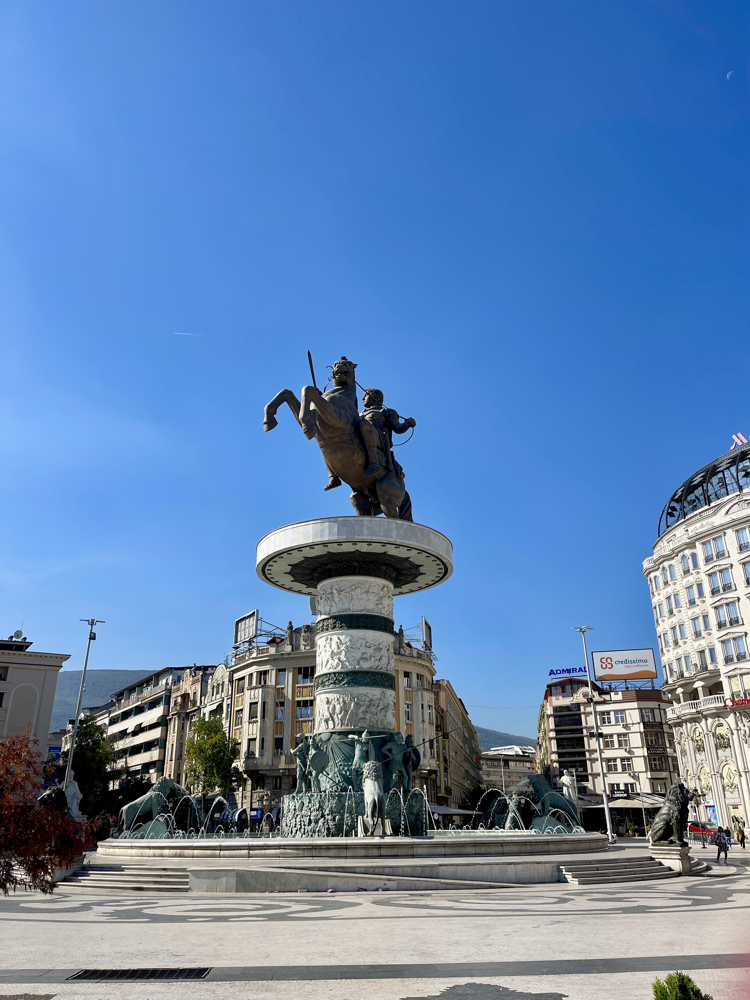
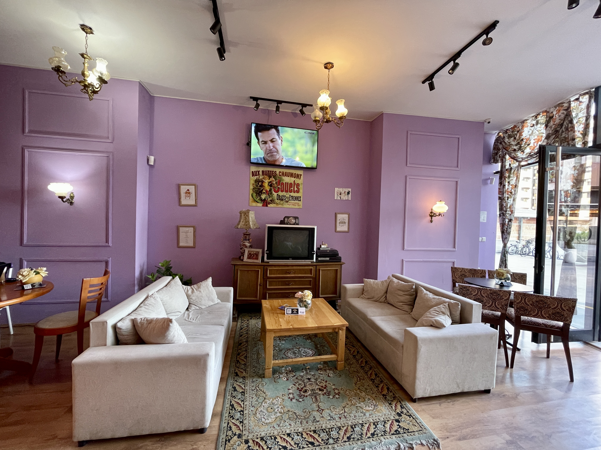
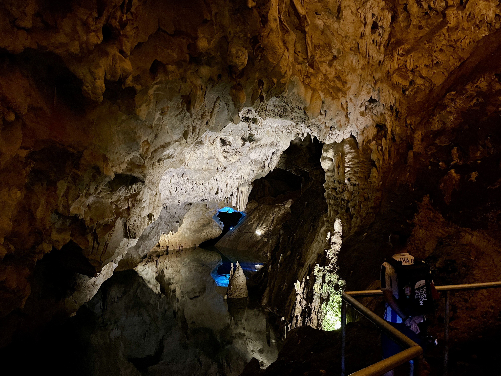
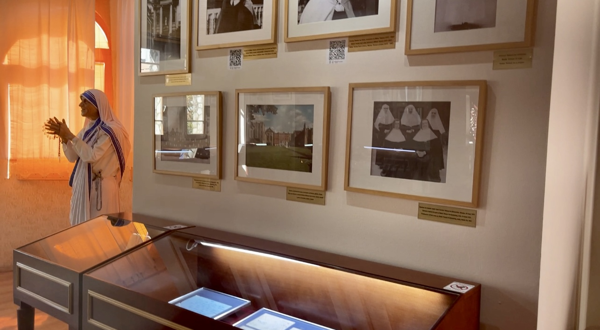
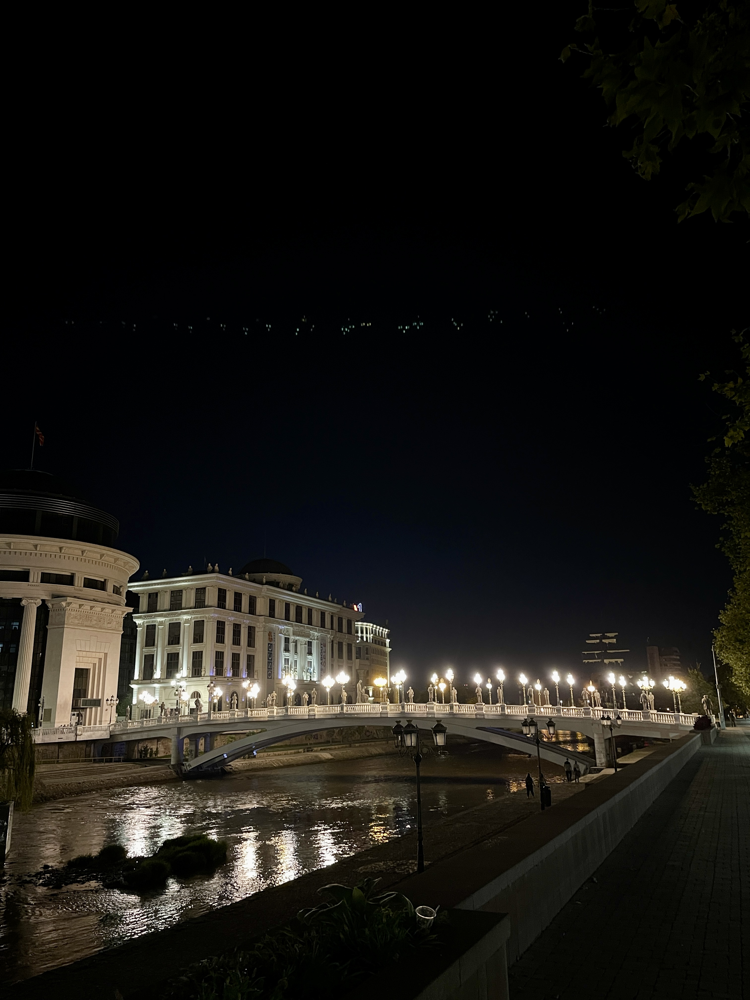
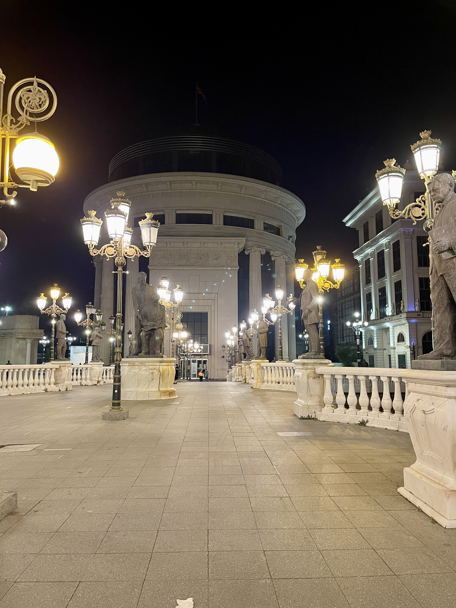
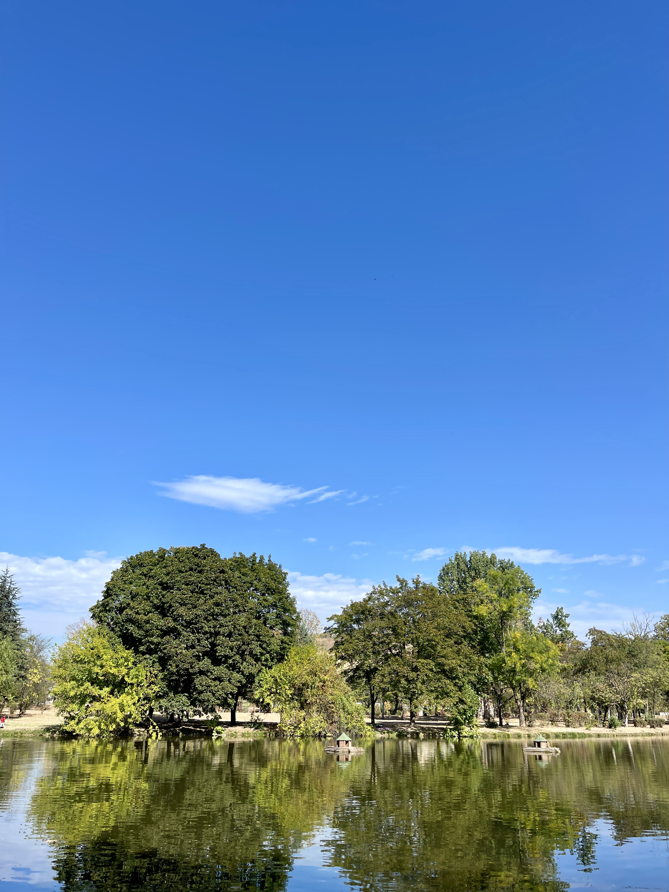
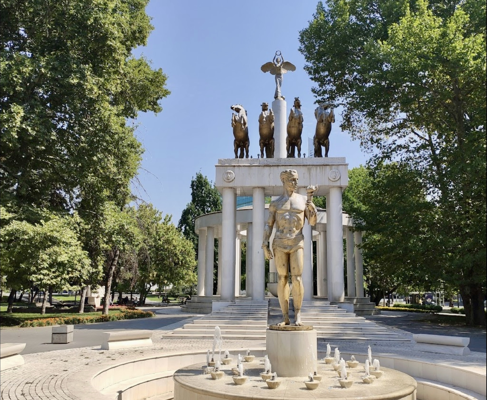
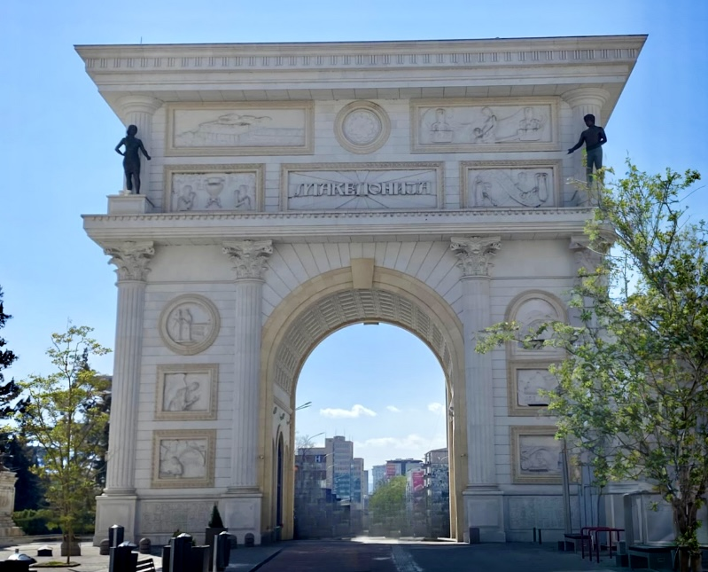
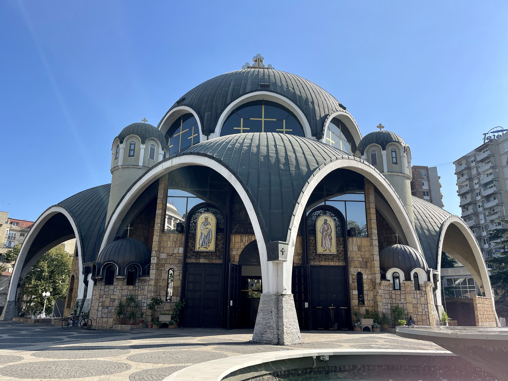

Skopje is the capital of North Macedonia, a country located in the center of the Balkan Peninsula. It is a lush, green city where gourmet food, drinks, traditions and culture are part of everyday life. No matter how many times you visit Skopje, there will always be something new and exciting to see or do.
&nbsp;

Enjoy every single moment in Skopje; you will fall in love.

## Statue of Alexander the Great

&nbsp;

In the main square, you can find a lot of statues, with the biggest one being **Alexander the Great**. Enjoy your time in this square and take some time to capture videos and photos; it's a great place to spend time and grab a bite to eat. At night, it's a beautiful place surrounded by lights and people, but don't worry; it's not too crowded.

&nbsp;

Skopje has many sculptures and statues of Alexander the Great, with the most iconic one situated in the middle of Macedonia Square. You can't miss the Horse Warrior, the official name of the statue, due to its immense size. It stands at 14.5 meters in height, mounted on a 10-meter-high vertical column. It's quite majestic and will certainly capture your attention.

&nbsp;

If you're lucky, you might also catch the occasional musical fountain show at night. In addition to the largest sculpture placed in the city square, you can find several other smaller statues throughout the city. These primarily represent significant historical figures, Macedonian artists, or random passersby, beggars, or divers. Searching for statues is one of the best things to do in Skopje and also one of the most enjoyable!

<!-- When she reached the first hills of the **Italic Mountains**, she had a last
view back on the skyline of her hometown _Bookmarksgrove_, the headline of
[Alphabet Village](http://google.com) and the subline of her own road, the Line
Lane. Pityful a rhetoric question ran over her cheek, then she continued her
way. On her way she met a copy. -->

<!--  -->

&nbsp;

<!--  -->

[Statue of Alexander the Great](https://maps.app.goo.gl/xEABzLfyHrNY39TR6)

### A Thematic Friends Cafe

&nbsp;

Another place you can visit is **The Friends Cafe Thematic**. It's not the usual itinerary because the cafe is not near the other sightseeing spots. I truly recommend this place because it's very nice, and you should not miss it if you have the time to go there.

&nbsp;

You can get there on foot, and it will take you around 30 minutes. Enjoy the city and its streets as you walk to the thematic cafe.

&nbsp;

<!--  -->

[Café „Central Perk“](https://maps.app.goo.gl/GftPUmYE6ztUP18SA)

8am – 12am

### The Old Bazar

&nbsp;

Spend time in the **Old Bazaar**; it's a place where you can walk all day and get lost in every single alley. You can find everything in this place, but keep in mind the time because it's quite large, and you can easily lose track of time.

&nbsp;

The Old Bazaar is one of Skopje's most popular attractions, filled with vibrant landscapes and interesting scents and sounds.

&nbsp;

You can find the best and most diverse collections of Ottoman architecture in this area because it used to be a significant trading center during the Ottoman period.

&nbsp;

[The Old Bazar](https://maps.app.goo.gl/KKcxR8mNVWjCJNUaA)

Free

##### Vodno Mountain , Lake of Matka and Cave (TOUR)

&nbsp;

The view from **Vodno** is incredible. I recommend taking a [TOUR](https://gyg.me/TJyY55v8) to go there because it's a place you have to visit.

&nbsp;

The tour covers three places: Vodno Mountain, the Church of Saint Panteleimon in Gorno Nerez, and a place where you can take a boat to visit a cave and then return to the starting point. It's definitely a great tour and takes only 4 hours.

&nbsp;

Vodno is an excellent choice if you wish to enjoy spectacular views of the surrounding peaks or for short nature getaways when you've had your fill of all the sculptures, noises, and city buildings.

&nbsp;

Overall, Vodno is a great place for a picnic or to spend the day in Skopje. It's definitely one of the best things to do in Skopje for those who enjoy outdoor activities.

&nbsp;

<!--  -->

[Vodno Mountain](https://maps.app.goo.gl/Hzsz8cJaJEBJRui87)

[Get Your Guide TOUR](https://gyg.me/TJyY55v8)

##### The Mother Teresa Memorial House

&nbsp;

**The Mother Teresa Memorial House** is a place you can visit for free, and it's a great place to spend some time. Inside, you can find a small house with many stories. It's not big, and you can see everything in about 30 minutes.

&nbsp;

We all know Mother Teresa and how she was a great humanitarian, but few people know that she was born in Skopje. That's why there's a memorial house in this city built in her honour, on the very spot where she was baptised.

&nbsp;

Inside, you'll find memorabilia, photos, and documents that chronicle her work and religious life. You can even watch a documentary about the Nobel Peace Prize-winning humanitarian's work in the multimedia center located beneath the museum.

&nbsp;

<!--  -->

[The Mother Teresa Memorial House](https://maps.app.goo.gl/u55AEw9jmyvR8etY9)

Free

Monday – Friday 09:00 – 20:00 / Saturday – Sunday 09:00 – 14:00

###### Stone Bridge

&nbsp;

The **Stone Bridge** is crowded because it connects both sides of Skopje, the old city, and the new city. The old city is the Old Bazaar, and in the new city, you can find the Main Square. Walking across the bridge, you can enjoy the view of the Vardar River.

&nbsp;

It was first built under the rule of the Roman emperor Justinian but was destroyed and repaired many times during the Ottoman period.

&nbsp;

[Stone Bridge](https://maps.app.goo.gl/3bqbcxkyAybL16sK7)

###### The Art Bridge

&nbsp;

**The Art Bridge** is another sight you can see from the Stone Bridge. I recommend visiting it at night because the lights are on, and you can enjoy the view from the Art Bridge better. You can also spot a large boat that functions as a restaurant.

&nbsp;

The Art Bridge was built in 2014 as part of the Skopje 2014 project.

&nbsp;

[The Art Bridge](https://maps.app.goo.gl/951nBrZxr9oDZz5X7)

###### The Skopje Fortress

&nbsp;

**The Skopje Fortress** is another place you can visit for free. You can walk on the walls and enjoy the city view. However, be aware that it's not a safe place because it lacks maintenance, and you may find many loose bricks.

&nbsp;

It was built in the 6th century during the reign of the Roman emperor Justinian I but was later damaged during the Ottoman period.

&nbsp;

The lighting of Kale Fortress provides a peaceful and serene dignity at night.

&nbsp;

<!--  -->

[The Skopje Fortress](https://maps.app.goo.gl/MDsVCDM3gYRo6Ptx8)

Free

Monday – Friday 09:00am – 7:00pm

###### Skopje City Park

&nbsp;

**Skopje City Park** is a green place you can visit when you have some free time. It's a vast park where you can have a great day. Enjoy the lake and take in the surroundings; the people are really nice.

&nbsp;

The park began to take shape in the 19th century and now stretches between October Revolution Boulevard to the west, Leninova Street to the east, Illinden Boulevard to the south, and the Vardar River to the north.

&nbsp;

Nearby is the Skopje Zoo, and the ticket costs only 1 euro. If you enjoy this tour, set aside 2 hours and visit the zoo.

&nbsp;

[Skopje City Park](https://maps.app.goo.gl/x41SaQ3ixKb69xM56)

###### Woman Warrior Park

&nbsp;

The **Woman Warrior Park** is a large park where you can find many sculptures, including the Woman Warrior. Everything is located nearby, making it easy to find this park.

&nbsp;

There are many monuments here, including the Woman Warrior monument placed in 1970 in honour of all Macedonian women who participated in World War II.

&nbsp;

[Skopje City Park](https://maps.app.goo.gl/PhY4CVfLzCP3rxML8)

###### Macedonia Gate

&nbsp;

The **Macedonia Gate** is a grand monument located near the main square where Alexander the Great is honoured. Pay attention to every single detail on the gate, and you'll discover the history behind the art on its walls.

&nbsp;

Completed in January 2012, the arch is 21 meters in height and is adorned with relief carvings depicting various historical events.

&nbsp;

Walk around the arch to admire the artworks in alabaster and gold, or you can enter through a door inside the arch to visit the souvenir shop, gallery, and observation deck.

&nbsp;

[Macedonia Gate](https://maps.app.goo.gl/zb5SuDfmkPgHqHUKA)

###### Macedonian Orthodox Church of Saint Clement of Ohrid

&nbsp;

The **Macedonian Orthodox Church** is a significant church that you can visit and take many pictures of. The architecture is impressive and definitely worth the visit.

Completed in 1990 by the Macedonian architect Slavko Brezovski, the church comprises a series of domes and arches that give it an unusual "bubble" shape. Inside, the wall frescoes and iconoclasts feature beautiful sculptures and paintings, including a giant mural of Jesus.

&nbsp;

[Macedonia Gate](https://maps.app.goo.gl/Luu5rY1st8T7uMGT7)

Monday – Friday 09:00am – 8:00pm

###### Mustafa Paša

&nbsp;

It was a great experience to visit this place; unfortunately, it was closed when we went, but you can still walk in the garden and feel the energy there.

&nbsp;

Remember to cover your hair and body before entering the **Mosque**.

&nbsp;

It was completed in 1492 by the order of Mustafa Pasha, the same vizier who commissioned the hammam I mentioned earlier.

&nbsp;

In a word, the design is elegant, with all the alabaster domes, beautiful fountains, and rose gardens. The delicate blue paintings beneath the domes of the main entrance resemble Delftware ceramics.

&nbsp;

[Mustafa Paša](https://maps.app.goo.gl/tvuMFroru3uPj5aF9)

Free

&nbsp;

&nbsp;

###### More About Skopje

🙏🏾 **Religion**: The predominant religion in North Macedonia is Eastern Orthodox Christianity, with a significant Muslim minority.

🗣️ **Language**: The official language of North Macedonia is Macedonian. Albanian is also widely spoken, and there are other minority languages.

🤑 **Currency**:The official currency of North Macedonia is the Macedonian Denar (MKD).

&nbsp;

💡 **Travel Tip**:
_See here if you need [luggage storage in Istanbul](https://www.nannybag.com/en)._

&nbsp;

<iframe src="https://www.google.com/maps/d/u/0/embed?mid=1nn6oXDDUNvQjh24b4gsuvHa0soTpm-c&ehbc=2E312F" width="1000" height="380" class="map-iframe"></iframe>

&nbsp;

&nbsp;

 <iframe width="500" height="280" src="https://www.youtube.com/embed/tp9imBs010o?si=Glyxx9wPYaHYmeJC" title="YouTube video player" frameborder="0" allow="accelerometer; autoplay; clipboard-write; encrypted-media; gyroscope; picture-in-picture; web-share" allowfullscreen class="videos-iframe"></iframe>

<iframe width="500" height="280" src="https://www.youtube.com/embed/7jp-bgVDx-U?si=OB-E9PshdRPKzb5N" title="YouTube video player" frameborder="0" allow="accelerometer; autoplay; clipboard-write; encrypted-media; gyroscope; picture-in-picture; web-share" allowfullscreen class="videos-iframe"></iframe>

&nbsp;

###### Tours I recommend

&nbsp;

&nbsp;
