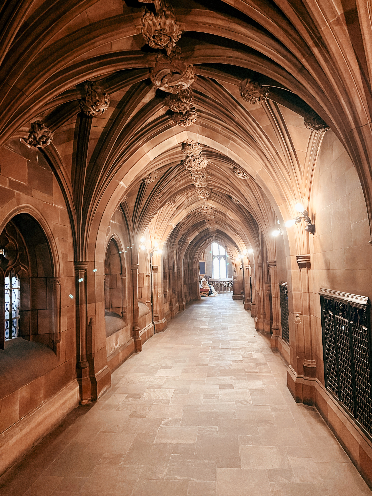
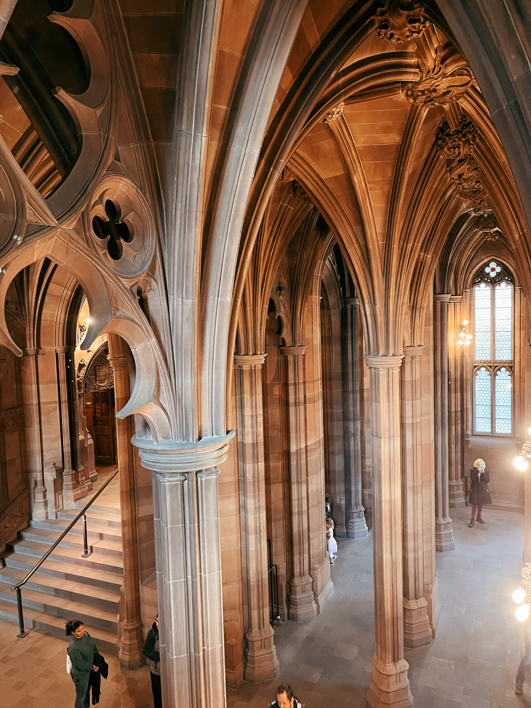

To go to Manchester is an incredible experience because it is such a nice city. And also you can go on a day trip to Liverpool and have a great experience in the Beatles city.

&nbsp;

Enjoy every single moment in Manchester; you will fall in love.

## ✈ Piccadilly Gardens

Piccadilly Gardens is a bustling place with a great atmosphere where you can see people playing, dancing, and enjoying various activities.

You can grab a coffee and spend some time there.

&nbsp;

[Piccadilly Garden](https://maps.app.goo.gl/xAJUW1FYin8P8g2J6)

Free

24/7

&nbsp;

### ✈ Afflecks

**Afflecks** is a place you can find everything in one place, a lot of burrows.

Afflecks, formerly known as Affleck’s Palace, is an iconic indoor market located in Manchester, England. Situated in the vibrant Northern Quarter, it occupies the junction of Church Street, Tib Street, Dale Street, and Oldham Street.

This eclectic emporium is home to dozens of independent stalls, small shops, and boutiques, making it a hub for fledgling designers in punk, retro, and experimental fashion.

&nbsp;

<!--  -->

[Afflecks](https://maps.app.goo.gl/4eRBAkRh3sM7GMf9A)

Free

Mon-Fri:10:30 am to 6:00 pm, Sat:10:00 am to 6:00 pm, Sun: 11:00 am to 5:00 pm.

&nbsp;

### ✈ John Rylands Research Institute and Library

&nbsp;

This place have to be at the top of your itinerary; they are free, vast, and beautiful.

The place is impressive with a lot of books and rooms. I loved having the opportunity to visit this institute.

You can read our study there if you want. 🙃

&nbsp;

The John Rylands Research Institute and Library is a magnificent neo-Gothic building situated on Deansgate in Manchester, England. It forms part of the University of Manchester and holds a special place in the city’s cultural landscape.

&nbsp;

Founder: The library was founded by Enriqueta Augustina Rylands in memory of her husband, John Rylands. Their vision was to create a lasting legacy that would benefit scholars, researchers, and the public alike.

&nbsp;

Rare Collections: Inside this architectural gem, you’ll find one of the world’s most remarkable collections of rare books, manuscripts, and archives. These treasures span various disciplines and historical periods, making it a haven for academics and history enthusiasts.

&nbsp;

Public Access: The library opened its doors to the public in 1900 as a generous gift to the people of Manchester. It stands as a testament to the power of knowledge, culture, and community.

&nbsp;

[John Rylands Research Institute and Library](https://maps.app.goo.gl/PbvuDF95NeKyGyBF8)

Free

Wed-Sat: 10am - 5pm

&nbsp;

##### ✈ Canal St

&nbsp;

This village is a cozy place, easy to find, and has a street with many bars.

By the river, you can have a great day while enjoying the view.

Canal Street, located in the heart of Manchester, England, is a vibrant and iconic destination.

&nbsp;

Location: Canal Street runs through Manchester city center in North West England and serves as the nucleus of Manchester’s gay village. It’s a pedestrianized street that hugs the west side of the Rochdale Canal.

&nbsp;

LGBTQ Hub: Known for its inclusivity and welcoming atmosphere, Canal Street is a hotspot for both local and visiting LGBTQ individuals. Here, you’ll find a delightful mix of gay bars, restaurants, and shops.

&nbsp;

Day and Night: During the warmer months, Canal Street comes alive with visitors—often including LGBT tourists from around the world—exploring its offerings. Whether it’s daytime or nighttime, the street buzzes with energy and celebration.

&nbsp;

Historical Roots: The area around Canal Street developed alongside the construction of the Rochdale Canal in 1804. Initially, it served as an industrial zone with cotton factories. However, by the mid-20th century, it began to be associated with the LGBTQ community.

&nbsp;

Urban Decay and Transformation: As the cotton industry declined, the area faced urban decay. Yet, it became a clandestine meeting place for gay men due to its dark, unvisited corners near convenient transport links.

&nbsp;

Challenges and Progress: In the 1980s, Chief Constable James Anderton faced controversy for his policing approach in the Canal Street area. Despite challenges, the community persisted, and landmarks like Manto (founded in 1990) played a pivotal role in shaping the current style of bars and clubs in the Village.

&nbsp;

<!--  -->

[Canal St](https://maps.app.goo.gl/WsYh4EfjkrSs8xKEA)

Free

24/7

&nbsp;

##### ✈ Richmond Tea Rooms

&nbsp;

I loved this tea room; it is so cute and enjoyable. The theme for this tea place is Alice in Wonderland.

Try the vanilla tea; it is wonderful.

You have to make a prior reservation on-site. However, you can try to get a place without a reservation, but it is not recommended.

&nbsp;

As you step through the door, you’ll find yourself immersed in an award-winning ‘Alice in Wonderland’ inspired setting. The decor is a delightful blend of fantasy and elegance, paying homage to Lewis Carroll’s beloved tale.

&nbsp;

Afternoon Tea Extravaganza: Richmond Tea Rooms is renowned for its exquisite afternoon tea experience. Picture freshly prepared sandwiches, delectable cakes, and treats—all individually crafted by their talented chefs. And let’s not forget the scones, infused with tea flavors!

&nbsp;

Tea Wonderland: Their tea selection is a journey around the globe. From traditional favorites to exotic and rare teas, there’s something for every taste. Whether you’re a chai enthusiast or a green tea aficionado, Richmond Tea Rooms has you covered.

&nbsp;

Magical Spaces: Explore different corners of wonderland. Dine under twinkling lights in the enchanted forest area, where woodland themes come alive. Or cozy up in the orangery, a warm garden retreat even on rainy Manchester days.

&nbsp;

Inclusivity: Richmond Tea Rooms welcomes everyone. They offer vegan and gluten-free options daily, ensuring that every guest feels catered to. Whether it’s a special occasion or a spontaneous afternoon out, they aim to create lasting memories.

&nbsp;

<!--  -->

[Richmond Tea Rooms](https://maps.app.goo.gl/V6DFbrLbVJTCvcHJA)

**Open daily between** Mon-Sun: 10am - 7pm

&nbsp;

###### ✈ - Etihad Stadium [TOUR](https://www.getyourguide.com/manchester-l1128/manchester-city-etihad-stadium-tour-t155085/?partner_id=3K1OV70&utm_medium=online_publisher)

&nbsp;

Whether you’re fun or not, it’s definitely worth the visit because it’s a great experience you can have. You can take a tour around the camp and inside as well.

&nbsp;

The [**Etihad Stadium**](https://www.getyourguide.com/manchester-l1128/manchester-city-etihad-stadium-tour-t155085/?partner_id=3K1OV70&utm_medium=online_publisher) is a football stadium located in Manchester, England. It is the home stadium of Manchester City F.C. and has a seating capacity of **53,400**. The stadium was built for the 2002 Commonwealth Games and was later converted into a football stadium to provide Manchester City with a modern replacement for Maine Road.

&nbsp;

<!--  -->

[Etihad Stadium ](https://maps.app.goo.gl/FijyLUgERNcRLssbA)

30,49€

&nbsp;

###### ✈ St. Peter's Square

You can spend a few minutes walking around this square. It’s busy, so you can see the life in Manchester just by looking around. Around the square, you can see a lot of buildings and libraries. If you want to visit the Library of Manchester, it’s a beautiful place, and there is a cafe inside where you can grab some food and sit and enjoy the moment.

&nbsp;

<!--  -->

[St. Peter's Square](https://maps.app.goo.gl/irKgoyYzfhXwC53i8)

Free

24/7

&nbsp;

###### ✈ Manchester Central Library

Manchester Central Library is the main library and information service headquarters in Manchester, England. It is located in St Peter’s Square and was designed by E. Vincent Harris. The library was opened in 1934 and has undergone several renovations since then.

&nbsp;

The library has a wide range of services including archives, family and local history, rare books and special collections, and a business and intellectual property center.

&nbsp;

<!--  -->

[Manchester Central Library ](https://maps.app.goo.gl/c4bDNh3WuRJt73gp6)

Free

**Open daily between** Mon - Thu: 9am-8pm | Fri - Sat: 9am - 5pm | Sun: Closed

&nbsp;

###### ✈ More About Manchester

🙏🏾 **Religion**: The major religions represented include Christianity, Islam, Hinduism, Sikhism, and others.

🗣️ **Language**: English is the primary and official language spoken in Manchester.

🤑 **Currency**:The official currency in Manchester, as in the entire United Kingdom, is the British Pound Sterling (£)

&nbsp;

💡 **Travel Tip**:
_See here if you need [luggage storage in Manchester](https://www.nannybag.com/en)._

&nbsp;

<iframe src="https://www.google.com/maps/d/u/0/embed?mid=1DCOw7jRUahzTWF4MiYg7jkQh9PrLe5Y&ehbc=2E312F" width="1000" height="380"></iframe>

&nbsp;

<!-- 
&nbsp; -->

 <iframe width="500" height="280" src="https://www.youtube.com/embed/hGnhguLgGe0?si=4Nzoz6g1N3Ntj3C_" title="YouTube video player" frameborder="0" allow="accelerometer; autoplay; clipboard-write; encrypted-media; gyroscope; picture-in-picture; web-share" allowfullscreen></iframe>

&nbsp;

###### ✈ Tours I recommend

&nbsp;

&nbsp;
