**Naples** is a vibrant city in **southern Italys**, full of life, culture, and charm. From its historic streets and breathtaking coastal views to its rich traditions and legendary cuisine, Naples offers an unforgettable experience for every traveler.
&nbsp;

Enjoy every single moment at the festival; you will fall in love. XoXo

## ✈ Castel dell’Ovo

When we visited Naples, the castle was closed for construction, but it was still possible to get close and snap a few great photos.

**Castel dell’Ovo** is the oldest standing fortress in Naples, beautifully located on the seafront with panoramic views of the Gulf. Its name, which means “Egg Castle,” comes from a legend that the Roman poet Virgil placed a magical egg in its foundations to protect the city. Today, visitors can walk through its ancient halls, enjoy art exhibitions, and admire one of the best sunset views in Naples — all for free.

&nbsp;

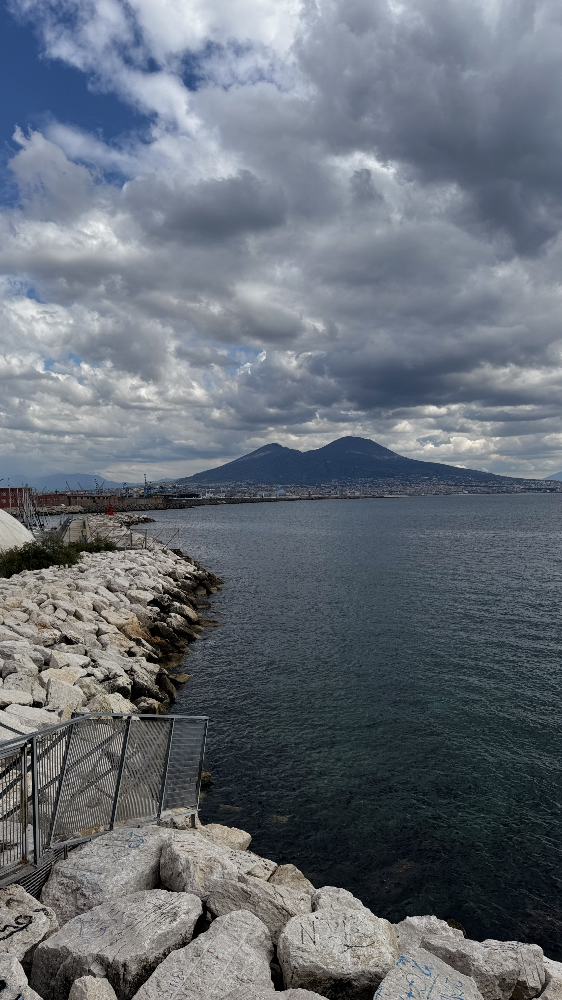

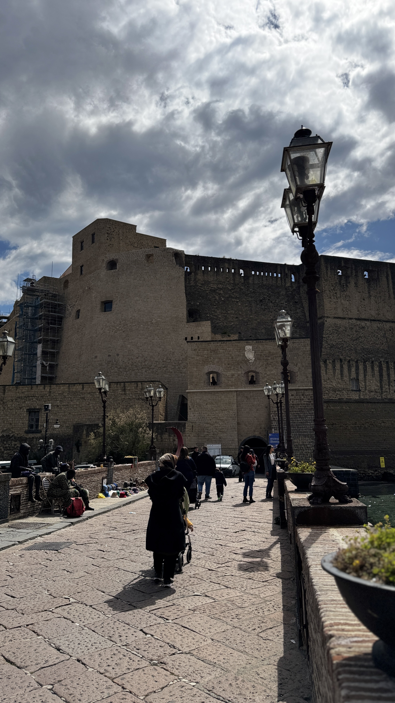

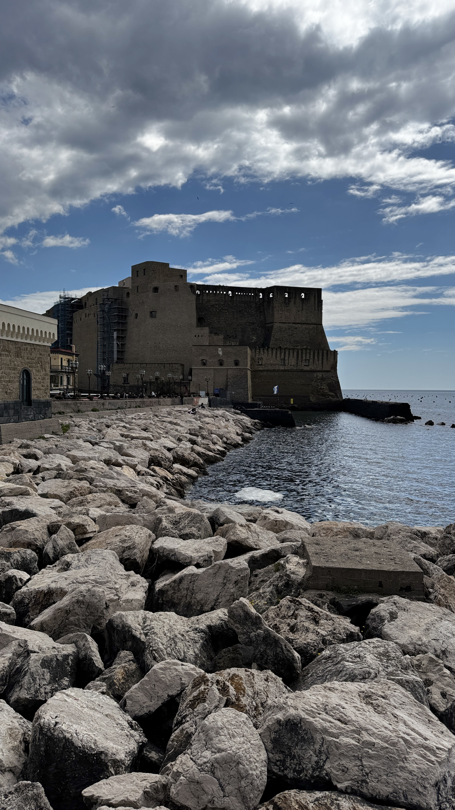

&nbsp;

<!--  -->

[Castel dell’Ovo](https://maps.app.goo.gl/qnPk5woWxWw1vV718)

Closedtemporarily closed

&nbsp;

### ✈ Chiesa del Gesù Nuovo

Chiesa del Gesù Nuovo is one of the most unique and impressive churches in Naples. Its striking façade, made of diamond-shaped stones, was originally part of a noble palace before becoming a church in the 16th century. Inside, you'll find stunning Baroque architecture, elaborate frescoes, and the tomb of Saint Giuseppe Moscati, a beloved Neapolitan doctor and saint. It's a peaceful and inspiring place, right in the heart of the historic center.

<!-- 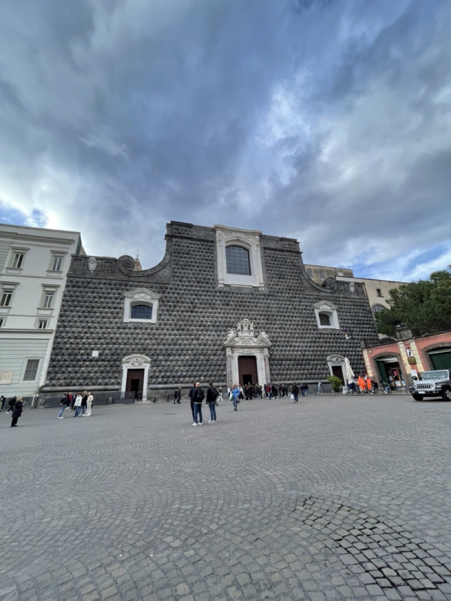 -->

&nbsp;

[Chiesa del Gesù Nuovo](https://maps.app.goo.gl/Ft7Q5QtZMpK9uk1r6)

Free

8am - 12:45pm | 4am - 7pm

<!-- ➽ **How to get there**

**By Train** You can take the train from Zurich to Aathal. It takes around 26 minutes to which you should add a 20 minutes walk from Aathal station to the Jucker Farm.

**By Car** It takes around 30min by car to get to the farm. However, the parking space is quite limited and it might be difficult to find space. -->

&nbsp;

### ✈ The Pulcinella Statue

**The statue** is tucked away on a corner, so keep an eye out—you don’t want to miss this fun part of the Naples experience. And don’t forget to rub the nose for a bit of good luck!

**The Pulcinella Statue** is a fun and quirky stop in the historic center of Naples. Pulcinella is a traditional character from Neapolitan theater, known for his long nose and playful personality. The small bronze statue is hidden along Via dei Tribunali, and many visitors rub its nose for good luck. It’s a lighthearted photo spot that captures the spirit and humor of Naples.

&nbsp;

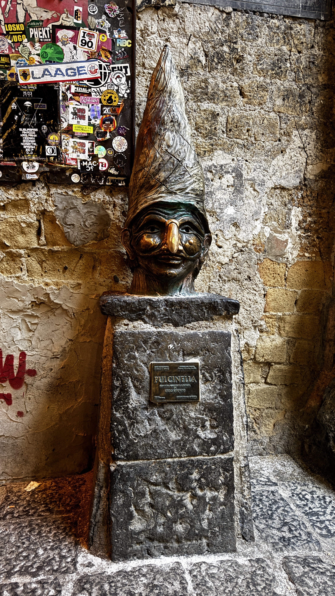

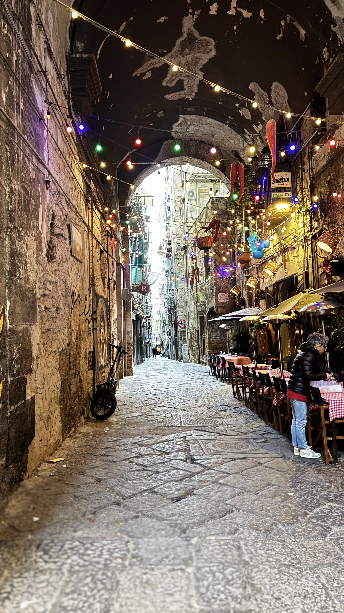

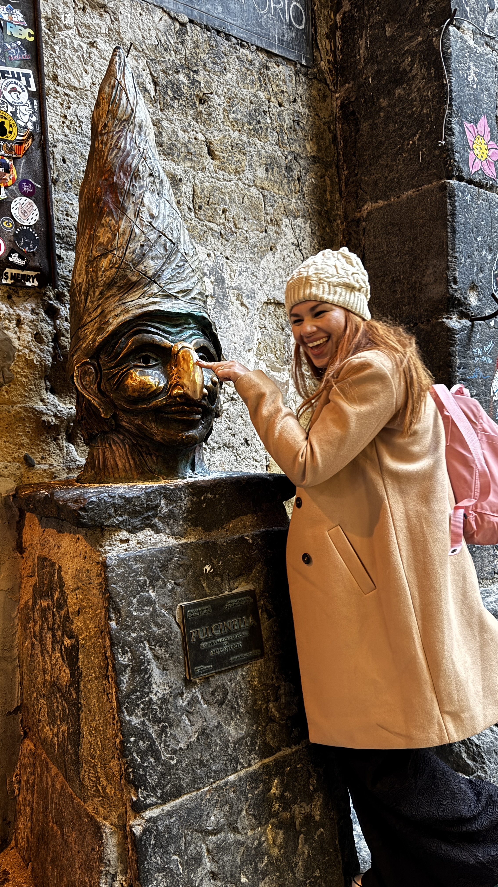

&nbsp;

[The Pulcinella Statue](https://maps.app.goo.gl/wtjjjNST6RTCeqot9)

24/7

Free

### ✈ Murale Diego Armando Maradona

A true delight for football lovers — the place isn’t very large, as it’s in an open space, but it’s well appreciated by both locals and tourists.

**The Diego Maradona Mural** is one of the most iconic street art pieces in Naples, located in the Spanish Quarter (Quartieri Spagnoli). Painted on the side of a building, the mural is a tribute to the legendary Argentine footballer who became a symbol of pride and passion for the city during his time with Napoli.

The area around the mural is filled with flags, graffiti, and shrines dedicated to Maradona, making it a must-see for football fans and a powerful expression of local culture.

&nbsp;

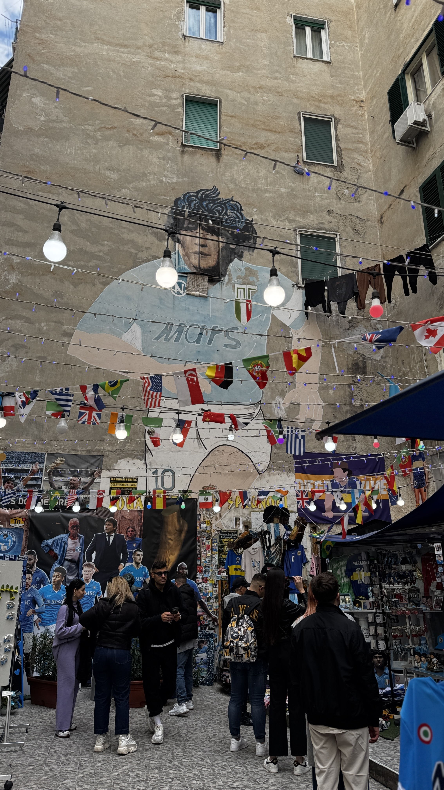

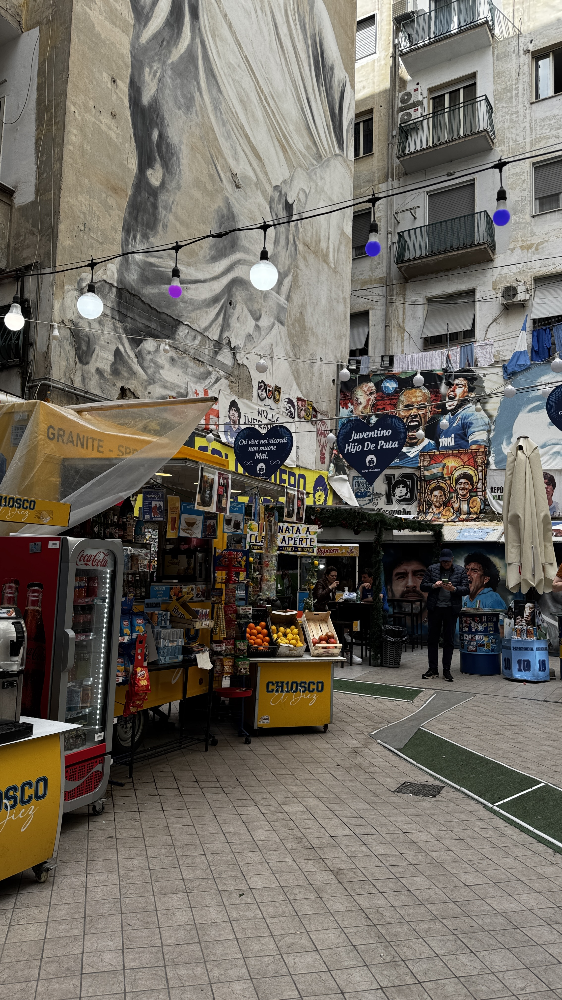

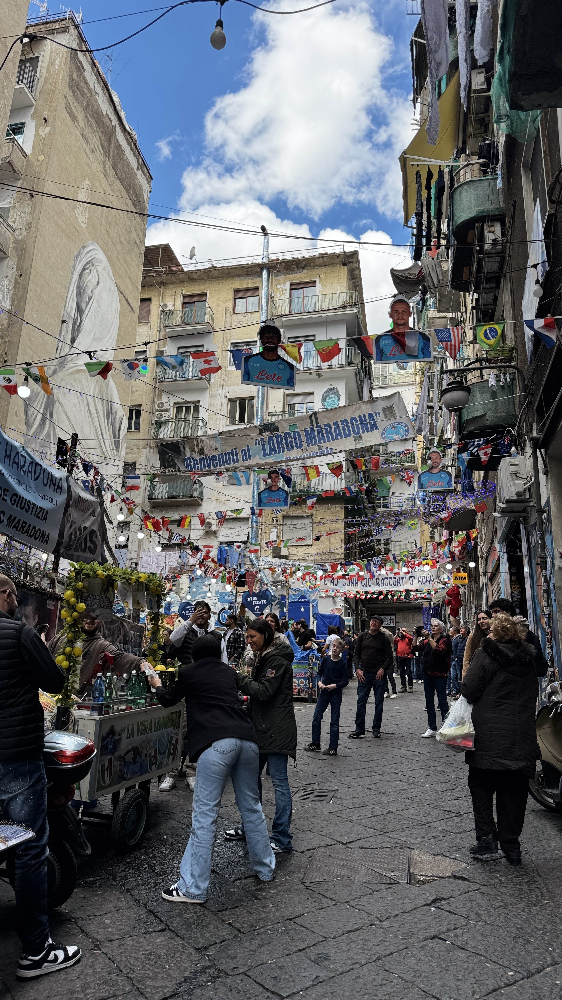

&nbsp;

[The Pulcinella Statue](https://maps.app.goo.gl/FkigdGPj5hRKANBe7)

24/7

Free

### ✈ Pompeii and Mount Vesuvius

We decided to visit both **Pompeii and Mount Vesuvius** on the same day with a tour from [Get Your Guide](https://www.getyourguide.com/naples-l162/from-naples-pompeii-and-vesuvius-guided-day-trip-with-lunch-t165716/?partner_id=3K1OV70&utm_medium=online_publisher), and I highly recommend it — it really helped us make the most of our time.

**Recommendations:**
For Vesuvius, make sure to wear comfortable clothes, but also something a bit warmer depending on the season, as it gets very windy at the top — and honestly, it can be freezing, especially if it’s raining. A raincoat is definitely a good idea.
Pompeii was incredible, but it was quite crowded. Having a guided tour made it much easier to go straight to the main highlights and learn about the history behind them.
If you prefer to explore on your own, that’s totally doable too — just make sure to rent an audio guide, because the site is huge and you can literally get lost in the ancient streets of Pompeii.

A visit to **Pompeii and Mount Vesuvius** is one of the most unforgettable day trips from Naples. Pompeii offers a fascinating look into ancient Roman life, with well-preserved ruins, streets, and even frescoes frozen in time by the eruption of Vesuvius in 79 AD. After exploring the ruins, you can hike up to the crater of Mount Vesuvius for a breathtaking view of the Bay of Naples — a powerful contrast between nature's beauty and its force.

&nbsp;

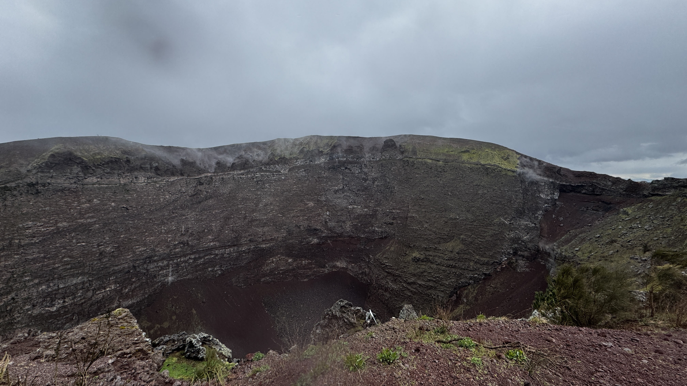

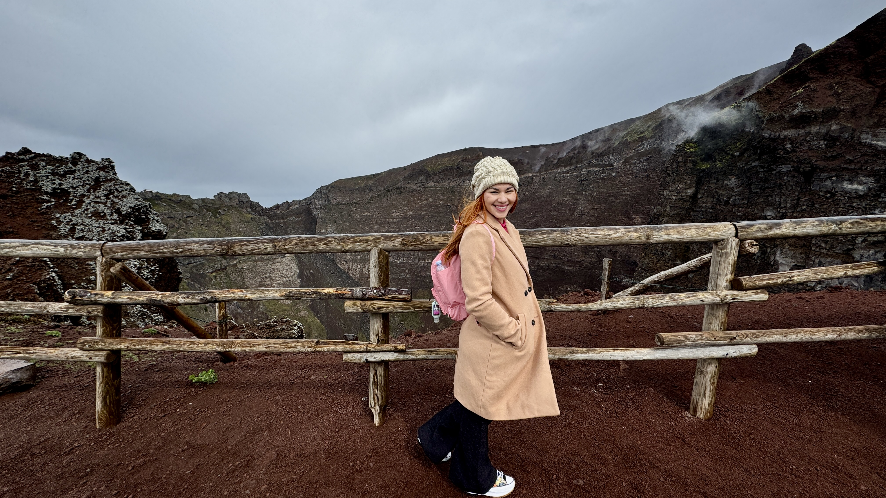

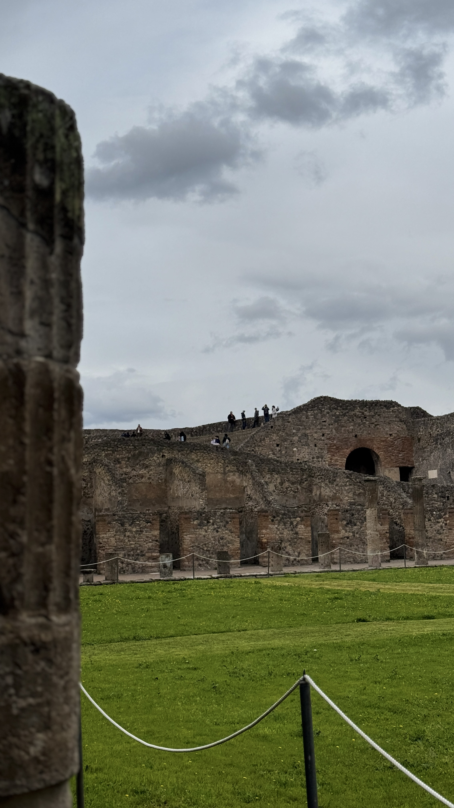

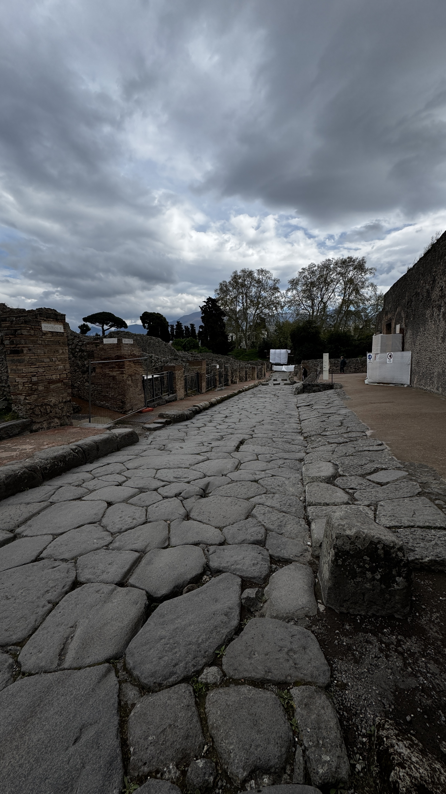

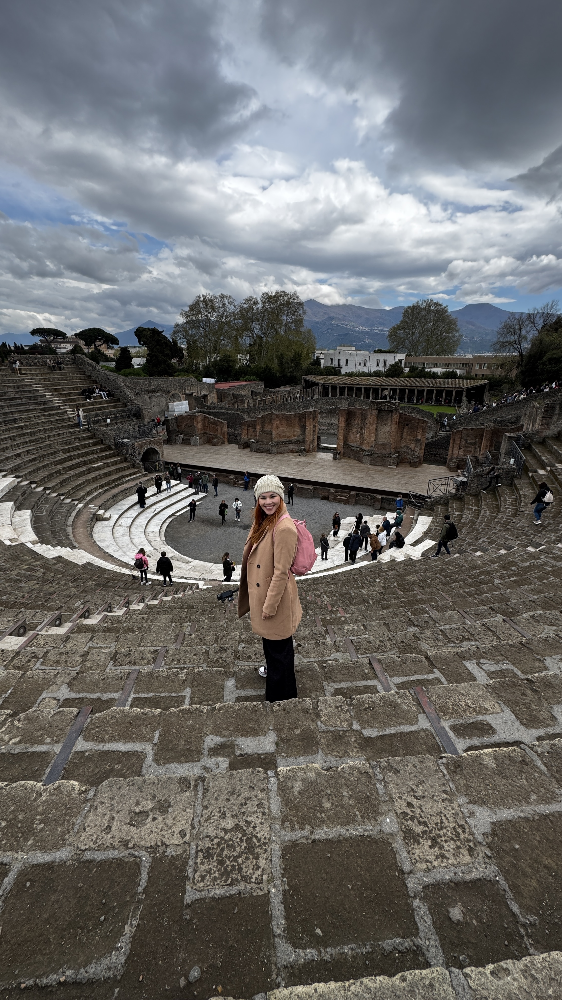

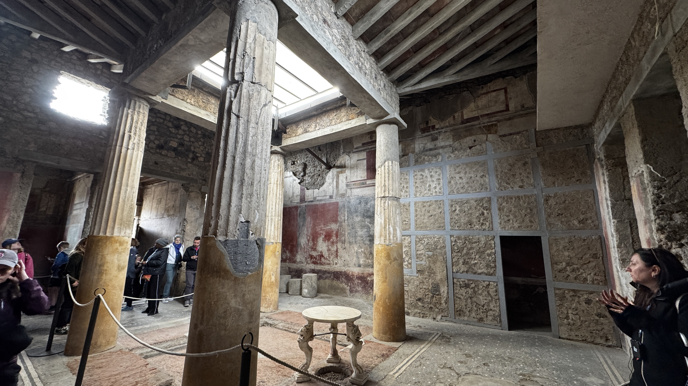

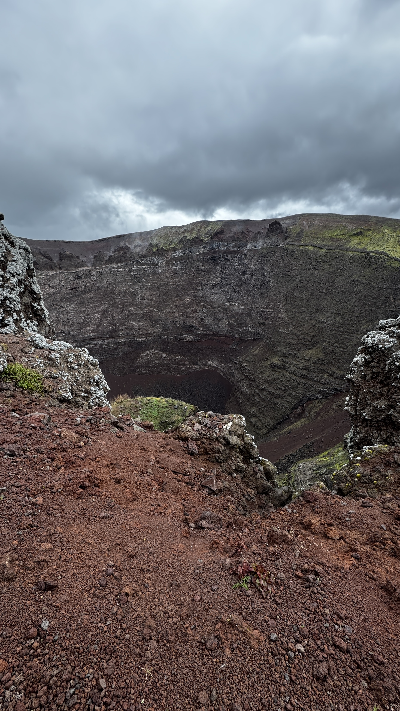

&nbsp;

<!--  -->
<!--  -->

[Get Your Guide](https://www.getyourguide.com/naples-l162/from-naples-pompeii-and-vesuvius-guided-day-trip-with-lunch-t165716/?partner_id=3K1OV70&utm_medium=online_publisher)

### ✈ Via dei Tribunali

The streets are full of color and life, with plenty of places to eat and shop for any souvenir you can imagine. There’s so much energy and joy in the air — it’s contagious! Just be careful with cars and scooters, as they’re still allowed in these narrow alleyways. But overall, walking through here is always a great experience.

**Via dei Tribunali** is one of the most iconic streets in Naples, located in the heart of the historic center. Lined with ancient churches, lively shops, street food stalls, and some of the city’s most famous pizzerias, it’s the perfect place to experience the true spirit of Naples. A walk through this narrow, bustling street is like stepping into the city's soul — full of history, flavor, and charm.

&nbsp;

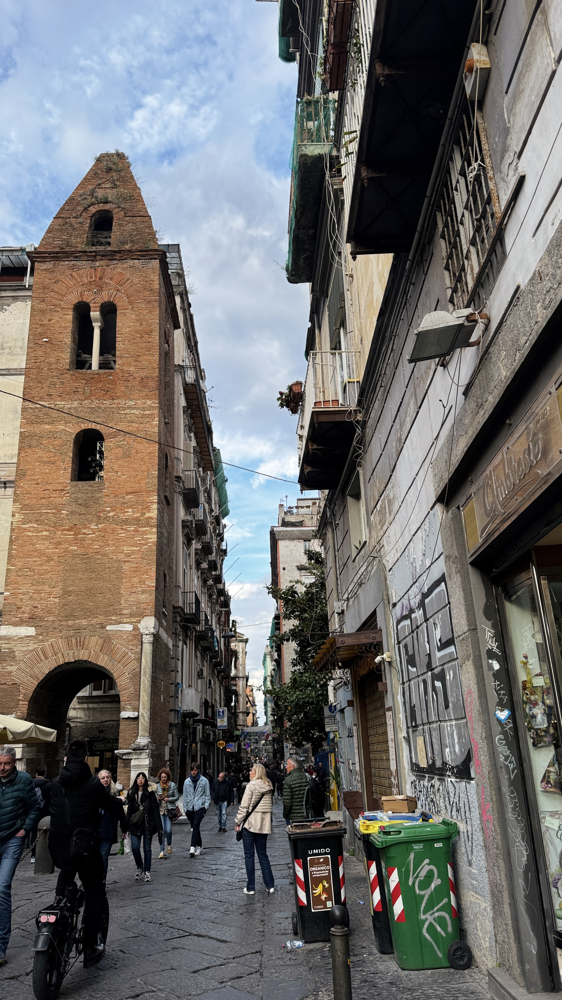

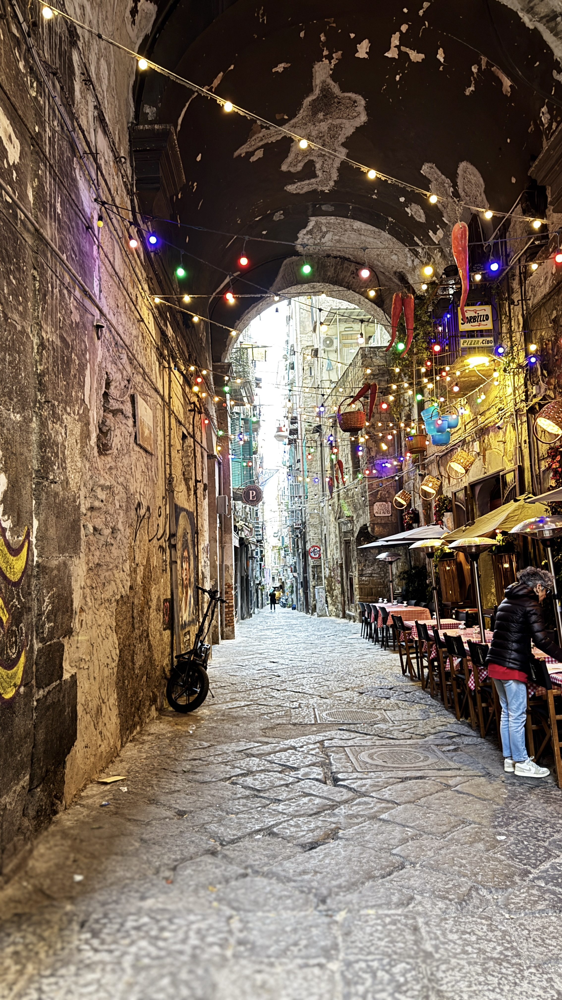

&nbsp;

[Via dei Tribunali](https://maps.app.goo.gl/D7QCALuh1oVFYafb9)

Free

24/7

### ✈ Via San Gregorio Armeno

Just like many streets in **Naples**, this one is filled with handmade work crafted with love — and it’s truly amazing to see the quality and beauty in each piece. It’s definitely worth spending time here browsing through the unique creations and finding something special to take home with you.

**Via San Gregorio Armeno** is one of the most famous and charming streets in Naples, especially known for its handmade nativity scene figures (presepi). All year round, artisans display and sell detailed figurines — from traditional religious scenes to fun characters like politicians, football players, and pop culture icons. The street is colorful, full of creativity, and a must-visit spot, especially during the Christmas season. It’s a magical place that blends art, tradition, and Neapolitan humor.

&nbsp;

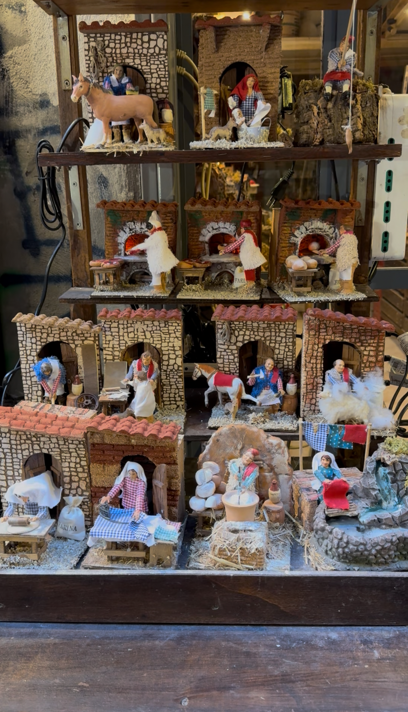

&nbsp;

[Via San Gregorio Armeno](https://maps.app.goo.gl/5zK6hn6EXNXyuE5t8)

Free

10am - 9pm

### ✈ Chiostri di Santa Chiara

It’s simply a beautiful place and absolutely worth visiting. Some areas were under construction during our visit, but that didn’t stop us from enjoying it to the fullest.

**Tip:** Go later in the day when it’s less crowded — it’s the perfect time to take amazing photos. Just a heads-up: sitting on the tiled benches is not allowed!

**Chiostri di Santa Chiara** is one of the most peaceful and beautiful spots in Naples. This 14th-century cloister, located behind the Church of Santa Chiara, features stunning hand-painted majolica tiles, elegant gardens, and a calm atmosphere that feels worlds away from the busy city streets. The colorful ceramic columns and benches, decorated with scenes of daily life and nature, make it a perfect place to slow down and enjoy the beauty of Neapolitan art and history.

&nbsp;

&nbsp;

[Chiostri di Santa Chiara](https://maps.app.goo.gl/7gHfvHJv9PYJuK74A)

7€

9:30am - 5:30pm

### ✈ Underground Naples

This tour was **absolutely amazing!** It can only be done with a guide, [Tour Get Tour Guide](https://www.getyourguide.com/underground-naples-l89414/naples-underground-entrance-ticket-t144159/?partner_id=3K1OV70&utm_medium=online_publisher) since the underground area is huge and easy to get lost in. But don’t worry — it’s not one of those boring tours with too much history and nothing to see. It included a great historical introduction and plenty of unique things to experience.

One of **the highlights** was walking through incredibly narrow tunnels where you can only move sideways, with just your phone flashlight to guide the way. (This part is optional — if you’re not comfortable, you can wait in a designated spot until the group returns.)

I thought it was spectacular! Totally worth adding to your Naples itinerary.

**Underground Naples** offers a fascinating journey beneath the city’s surface, revealing over 2,000 years of history. This guided tour takes you through narrow tunnels, ancient Roman aqueducts, and World War II shelters hidden below the lively streets of the historic center. It’s incredible to see how the underground has been used throughout different eras — from the Greeks and Romans to more recent times.

If you’re not claustrophobic, it’s an unforgettable experience that gives you a whole new perspective on Naples. Don’t forget to wear comfortable shoes — some passages are quite narrow and uneven!

&nbsp;

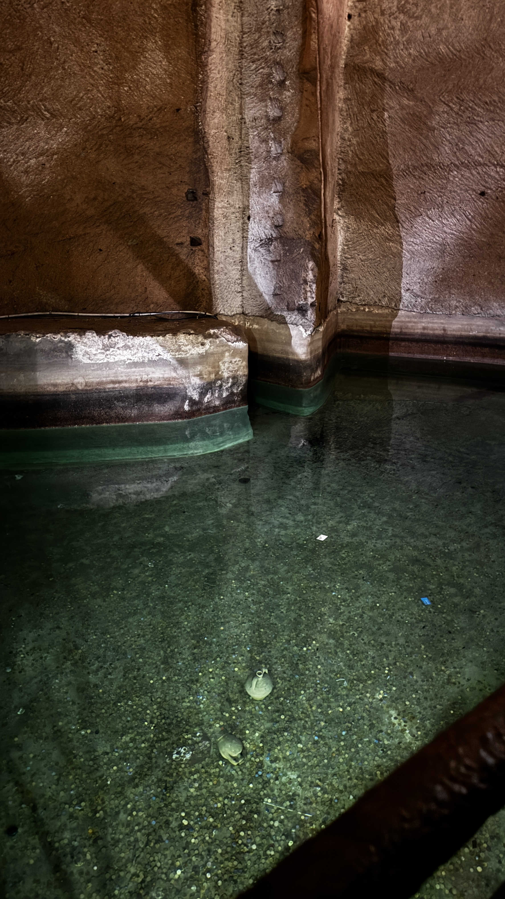

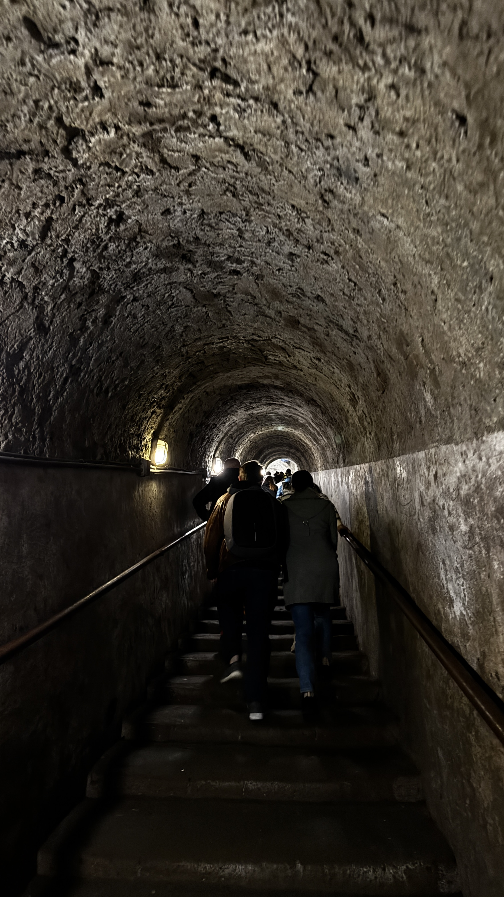

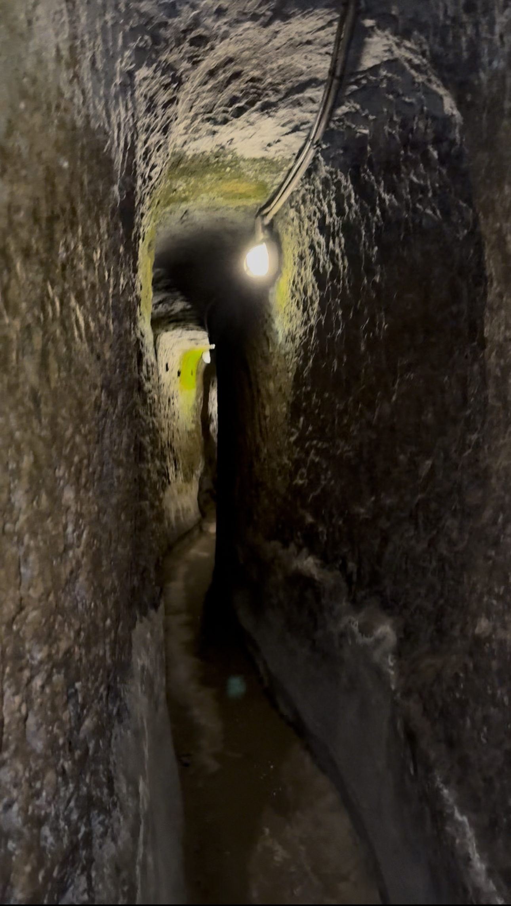

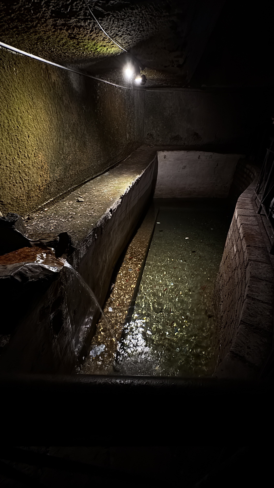

&nbsp;

<!--  -->

[Tour Get Tour Guide](https://www.getyourguide.com/underground-naples-l89414/naples-underground-entrance-ticket-t144159/?partner_id=3K1OV70&utm_medium=online_publisher)

10am - 6pm

### ✈ Quartieri Spagnoli

A fascinating neighborhood, **full of life** — just like every street in Naples. It’s definitely worth spending time wandering through these alleys. Don’t forget to look up and notice the clothes hanging on lines between the buildings — it’s such a classic Neapolitan sight!

As I mentioned before: be careful with cars and scooters, as they often pass by very close and quite fast.

**Quartieri Spagnoli**s, or the Spanish Quarters, is one of the most authentic and vibrant neighborhoods in Naples. Known for its narrow streets, hanging laundry, buzzing scooters, and colorful street art, this area gives you a true sense of everyday life in the city. It's chaotic, lively, and full of soul — with surprises around every corner.

Here you’ll find local shops, small family-run trattorias, shrines on street corners, and murals (including the famous Maradona mural). While the neighborhood once had a rough reputation, it has transformed into a cultural hotspot that welcomes visitors looking to experience the real, unfiltered Naples.

&nbsp;

&nbsp;

[Quartieri Spagnoli](https://maps.app.goo.gl/WiuRRtEJ2fNrdJQK7)

Free

24/7

### ✈ Castel Nuovo

In my opinion, this was one of the most disappointing stops of the entire trip. I expected more from such an impressive and beautiful structure, but unless you really enjoy looking at paintings and statues, there isn’t much else to see or experience.

I felt a bit let down, although we ended up visiting because some other places on our itinerary were closed. Still, it might be worth a quick stop if you're nearby — just don't expect too much.

&nbsp;

**Castel Nuovo**, also known as Maschio Angioino, is one of Naples’ most iconic medieval castles. Located near the port, it impresses with its massive towers and beautiful triumphal arch at the entrance, built to celebrate the arrival of King Alfonso I in the 15th century.

The castle has served as a royal residence, fortress, and even a prison over the centuries. Today, it houses the Civic Museum, where you can explore art, historical artifacts, and stunning architecture.

&nbsp;

Even if you don’t go inside, the exterior is worth a visit — especially for photos. It's an easy stop if you're arriving or leaving by ferry, as it's right by the port area.

&nbsp;

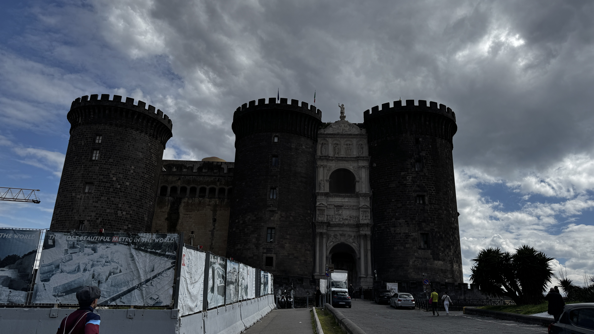

&nbsp;

[Castel Nuovo](https://maps.app.goo.gl/KKstEQYnxPPiV2bt8)

6€

8am - 5:30pm

### ✈ Toledo Metro Station

This is the place to experience the station’s stunning architecture, beautifully designed around the theme of light and water — it’s simply incredible to admire. Don’t miss it!

&nbsp;

**Toledo Metro Station** is more than just public transportation — it’s a work of art. Considered one of the most beautiful metro stations in the world, it features stunning mosaics, modern architecture, and a design that plays with light and color to create a surreal, almost underwater atmosphere.

The highlight is the “Crater de Luz,” a swirling blue dome that gives the sensation of being under the sea. Even if you’re not planning to take the metro, it’s worth stopping by just to admire the design and snap a few photos. It’s a perfect example of how Naples blends daily life with art and creativity.

&nbsp;

🚇 **By Metro (Line 1 – the "Art Line")**
Purchase a ticket (€1.10 for single ride, or €4.50 day pass) at any station, newsstand, or via the UnicoCampania app.

From Napoli Centrale (Piazza Garibaldi), take Line 1 toward Piscinola and ride for around

If you're near Piazza Dante, you can also catch Line 1 there—just one stop to Toledo.

&nbsp;

🚶**Walking**
The main entrance is directly on Via Toledo. If you're already in the area, stroll along the street and look for the metro sign—you'll find it right on the avenue.

&nbsp;

🚌 **By Bus or Taxi**
Buses like the 151, 168, and 130 stop near Piazza del Plebiscito/Via Toledo—just step off and it’s a short walk to the station.
Taking a taxi or rideshare is easy too—just say “Via Toledo, Napoli” and you'll be dropped nearby.

&nbsp;

📌 **Insider Tips**
Go during off-peak hours (mid-morning or after lunch) to enjoy the station’s art without crowds.

Don’t miss the “Crater de Luz”, a dramatic light installation, and the stunning underwater-themed mosaics.

&nbsp;

&nbsp;

[Toledo Metro Station](https://maps.app.goo.gl/Do4zTMTTQDuGM8yH6)

Free

24/7

### ✈ Galleria Umberto I

One of the places you definitely shouldn’t miss is this elegant gallery, with its beautiful architecture and charming atmosphere. It’s the perfect spot to take a short break at one of the many cafés inside.

In the center of the gallery, you’ll find the zodiac signs on the floor — and right in the middle, there’s a small hole. Legend says that if you spin three times on your heel over that spot, it will bring you good luck!

&nbsp;

**Galleria Umberto I** is a stunning 19th-century shopping gallery in the heart of Naples, right across from the famous San Carlo Theater. With its majestic glass dome, elegant ironwork, and marble floors, the Galleria is a beautiful mix of architecture, culture, and everyday life.

It’s a great place to take a break — whether for a quick espresso, some souvenir shopping, or simply to admire the architecture. The natural light streaming in through the glass ceiling makes the space feel open and grand, and the atmosphere is always lively but relaxed.

&nbsp;

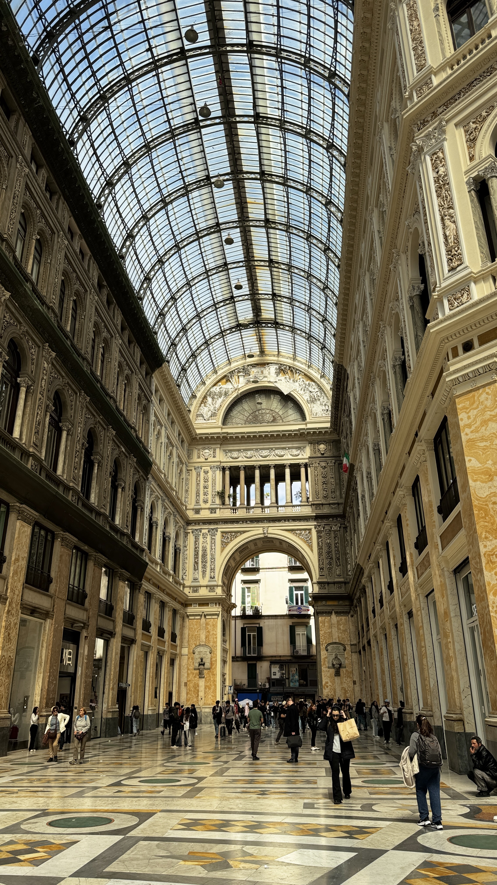

&nbsp;

[Galleria Umberto I](https://maps.app.goo.gl/qijPpZTz2h2aw8Mx7)

Free

9:30pm – 12am

### ✈ Tour Amalfi Coast

The perfect tour [Tour Get Your Guide](https://www.getyourguide.com/naples-l162/from-naples-full-day-sorrento-positano-amalfi-tour-t119305/?partner_id=3K1OV70&utm_medium=online_publisher) to explore the Amalfi Coast! We decided to join a guided tour because it’s more practical and makes it easy to visit all the right spots without wasting time. But if you enjoy driving, that’s a great option too — just be aware that the roads are very winding and require a lot of caution.

Our tour covered the beautiful towns of Sorrento, Positano, Amalfi, and Ravello. It was a relaxing yet informative experience, and definitely worth dedicating a day to this amazing adventure along the Amalfi Coast.

&nbsp;

**Touring the Amalfi Coast** is an unforgettable experience, offering breathtaking views of the Mediterranean, picturesque cliffside villages, and charming coastal towns. Whether you choose a guided bus tour, a private car, or a boat trip, the stunning landscapes and colorful houses cascading down the hills will leave you in awe.

&nbsp;

Popular stops include Positano, with its narrow streets and vibrant shops; Amalfi, known for its historic cathedral; and Ravello, famous for its gardens and panoramic views. Along the way, don’t miss the chance to taste local limoncello and fresh seafood.

&nbsp;

**Tips for the tour:** Wear comfortable shoes, bring a camera, and be ready for some winding roads with incredible photo opportunities at every turn. Early morning departures help avoid crowds and traffic.

&nbsp;

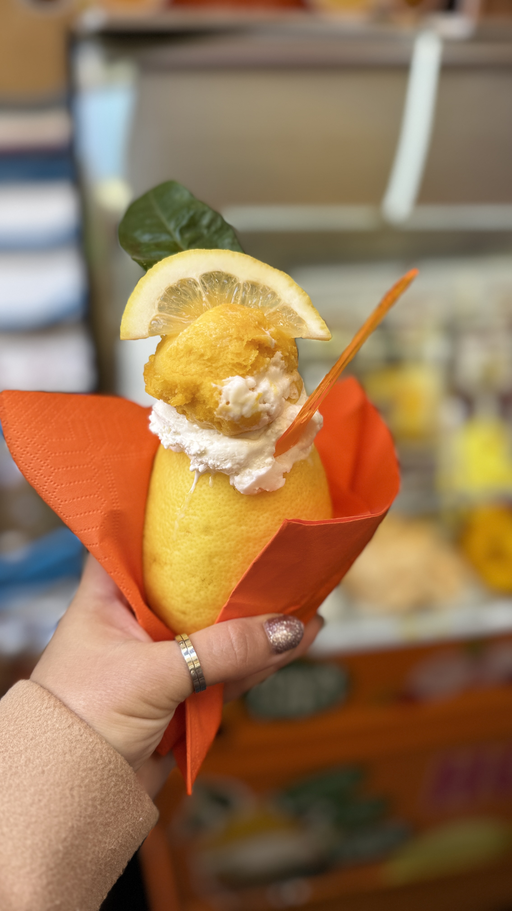

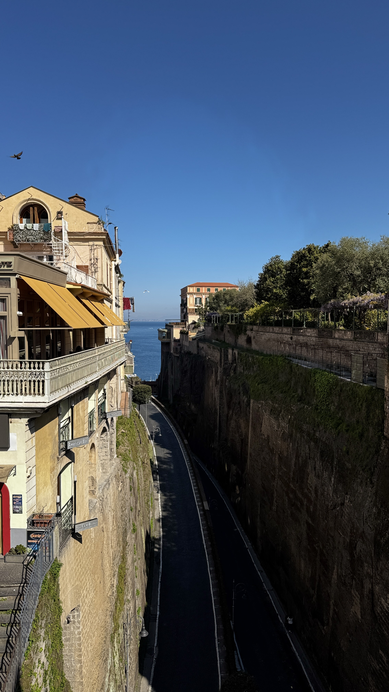

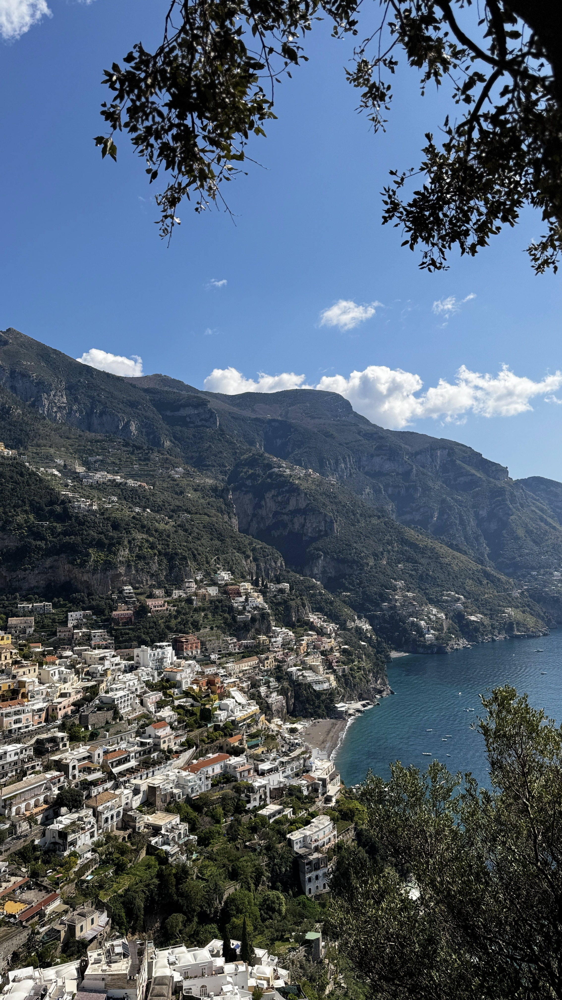

&nbsp;

<!--  -->

<!--  -->

[Tour Get Your Guide](https://www.getyourguide.com/naples-l162/from-naples-full-day-sorrento-positano-amalfi-tour-t119305/?partner_id=3K1OV70&utm_medium=online_publisher)

&nbsp;

### ✈ 🥘 Food

**Cuoppo Napoletano**
A paper cone filled with fried seafood (calamari, shrimp, small fish), vegetables, or even potatoes.
Crispy and perfect for eating while walking through the streets of the historic center.

**Pasta alla Genovese**
Despite the name, it’s a typical Neapolitan recipe.
Pasta (usually ziti) with a thick sauce made from slow-cooked meat and onions, resulting in a rich and comforting flavor.

**Spaghetti alle Vongole**
Spaghetti with fresh clams, olive oil, garlic, parsley, and a touch of chili pepper.
Simple, yet full of Mediterranean flavor.

**Panino Napoletano**
A soft bread filled with salami, cheese, eggs, and pork lard.
Perfect for a quick and tasty snack.

**Mozzarella di Bufala**
Made from buffalo milk, it’s creamy, fresh, and absolutely delicious.
Best enjoyed fresh, with tomatoes and olive oil.

**Limoncello**
A lemon liqueur typical of the Campania region (where Naples is located).
Refreshing and perfect as a digestif after meals.

**Sfogliatella**
A crispy puff pastry filled with sweet ricotta, candied fruit, and semolina.
Two variations:

Riccia: crispy puff pastry.

Frolla: softer, buttery dough.

**Babà al Rum**
A light and spongy cake soaked in rum liqueur.
An absolute icon of Neapolitan pastry.

**Gelato Artigianale**
Not exclusive to Naples, but the artisanal gelatos are amazing.
Try flavors like pistachio, lemon, or nocciola (hazelnut).

&nbsp;

###### ✈ More About Naples

🙏🏾 **Religion**: The city is predominantly Roman Catholic.

🗣️ **Language**: Italian, but many locals also speak Neapolitan.

🤑 **Currency**: Euro (€)

&nbsp;

💡 **Travel Tip**:
_See here if you need [luggage storage in Naples](https://www.nannybag.com/en)._

&nbsp;

<iframe src="https://www.google.com/maps/d/u/0/embed?mid=1yfhRI0WjvwMpfac0s4lG1x_IWIv6aPU&ehbc=2E312F" width="640" height="480"></iframe>

&nbsp;

<!--  -->

&nbsp;

<iframe width="700" height="236" src="https://www.youtube.com/embed/cGWzpuRpyuk?si=ISJJbYJj1_-7w4kR" title="YouTube video player" frameborder="0" allow="accelerometer; autoplay; clipboard-write; encrypted-media; gyroscope; picture-in-picture; web-share" referrerpolicy="strict-origin-when-cross-origin" allowfullscreen></iframe>

<iframe width="700" height="236" src="https://www.youtube.com/embed/PgBDD3xsB_I?si=FBW02kJtYUjN9SFI" title="YouTube video player" frameborder="0" allow="accelerometer; autoplay; clipboard-write; encrypted-media; gyroscope; picture-in-picture; web-share" referrerpolicy="strict-origin-when-cross-origin" allowfullscreen></iframe>

<iframe width="700" height="236" src="https://www.youtube.com/embed/62chU7_0uq0?si=9VT5FZnX0LdrhR_t" title="YouTube video player" frameborder="0" allow="accelerometer; autoplay; clipboard-write; encrypted-media; gyroscope; picture-in-picture; web-share" referrerpolicy="strict-origin-when-cross-origin" allowfullscreen></iframe>

<iframe width="700" height="236" src="https://www.youtube.com/embed/r-wyFOBvg7w?si=H33Yb6bPlICMdrg6" title="YouTube video player" frameborder="0" allow="accelerometer; autoplay; clipboard-write; encrypted-media; gyroscope; picture-in-picture; web-share" referrerpolicy="strict-origin-when-cross-origin" allowfullscreen></iframe>

&nbsp;

###### ✈ Tours I recommend

Powered by <a target="_blank" rel="sponsored" href="https://www.getyourguide.com/naples-l162/">GetYourGuide</a>

###### ✈ 🗣️ Useful Italian Phrases for Your Trip to Naples 🇮🇹

🍝 **At the Restaurant**

**Un tavolo per due, per favore.**
A table for two, please.

**Posso vedere il menù?**
Can I see the menu?

**Vorrei una pizza Margherita, per favore.**
I’d like a Margherita pizza, please.

**Il conto, per favore.**
The bill, please.

&nbsp;

🗺️ **Asking for Directions & Transport**

**Dove si trova la stazione della metro?**
Where is the metro station?

**Quanto costa il biglietto?**
How much is the ticket?

**Questo treno va a Sorrento?**
Does this train go to Sorrento?

&nbsp;

💬 **Basic Conversation**

**Buongiorno / Buonasera**
Good morning / Good evening

**Parla inglese?**
Do you speak English?

**Non parlo molto italiano.**
I don’t speak much Italian.

**Grazie / Prego**
Thank you / You’re welcome

&nbsp;

🛍️ **Shopping**

**Quanto costa questo?**
How much does this cost?

**Accettate carte di credito?**
Do you accept credit cards?

**Ce l’avete in un’altra taglia?**
Do you have it in another size?

&nbsp;

&nbsp;
