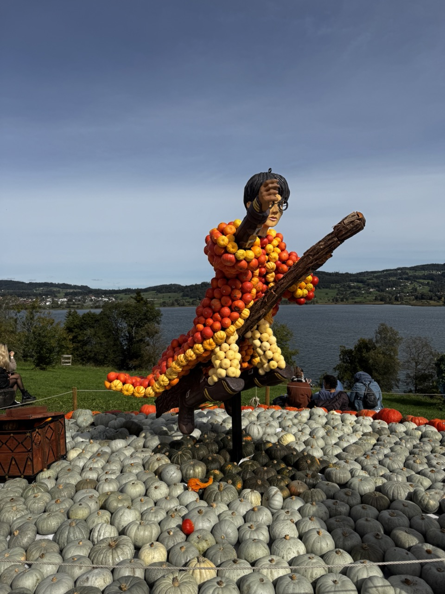
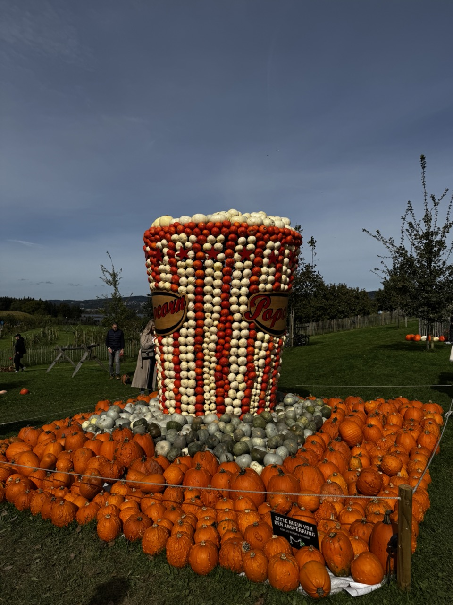
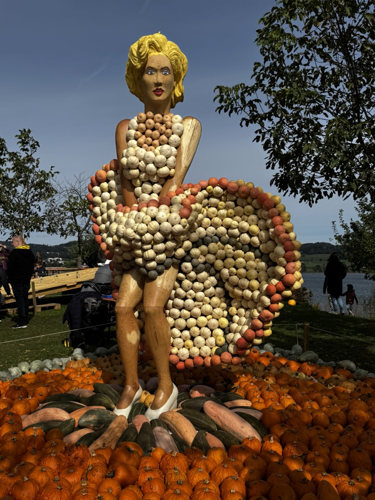
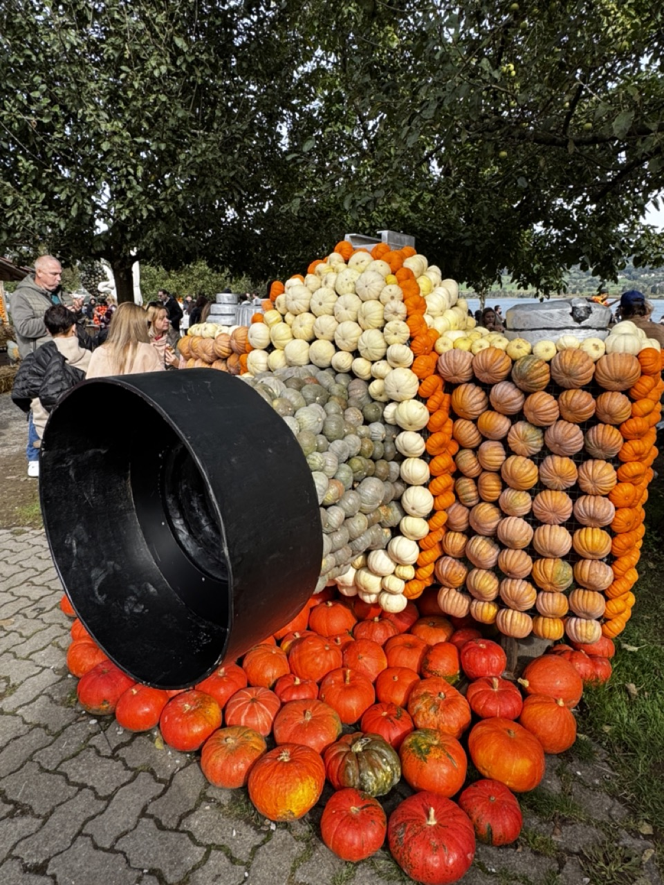
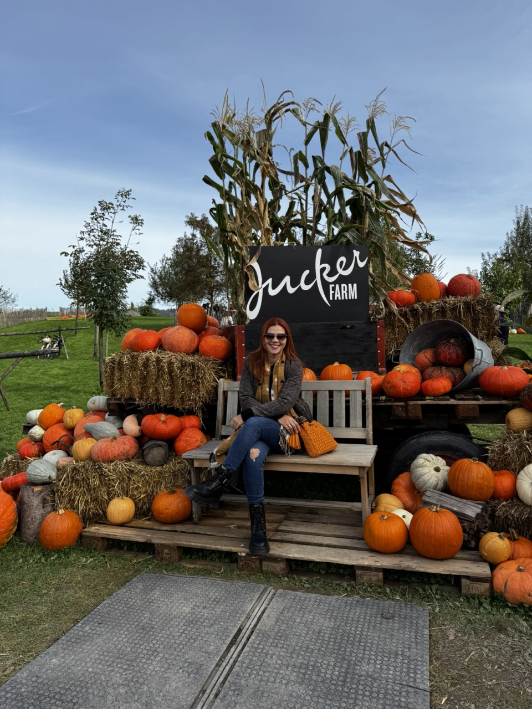
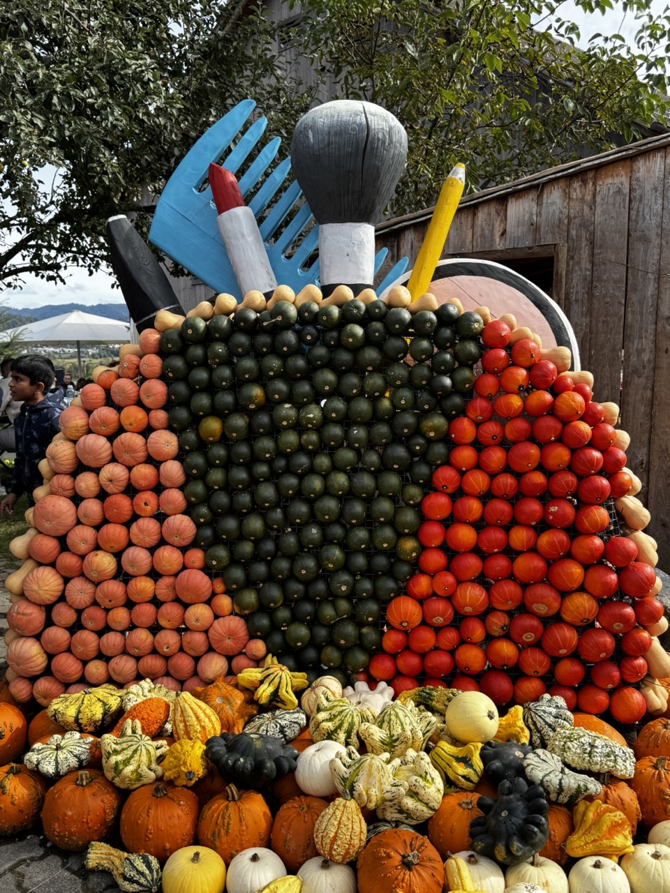
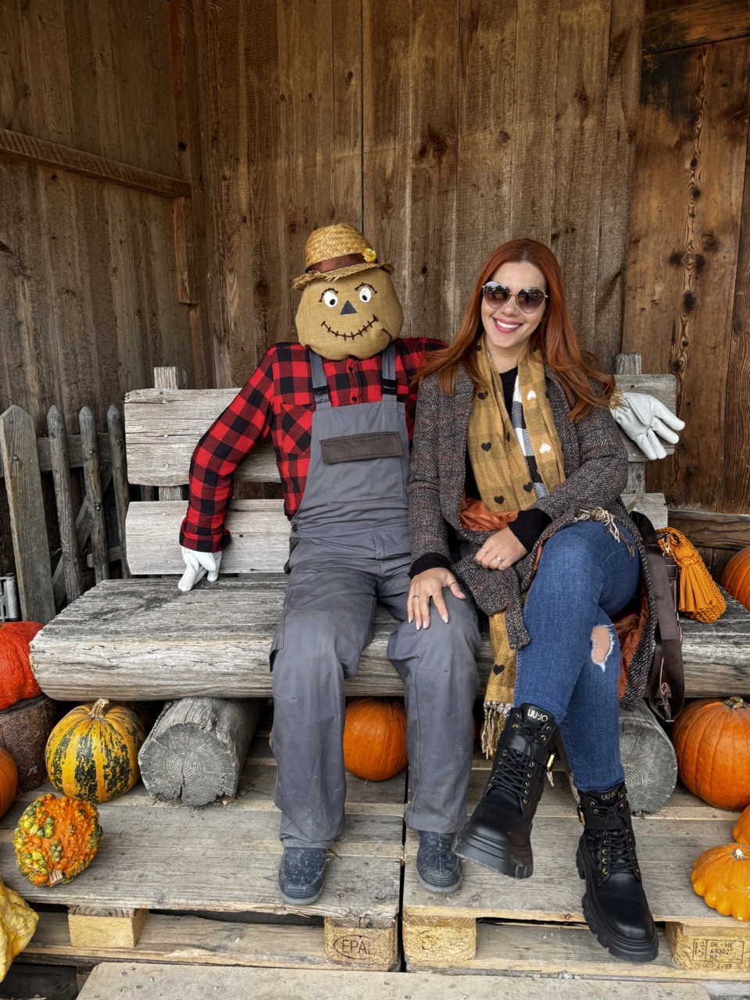
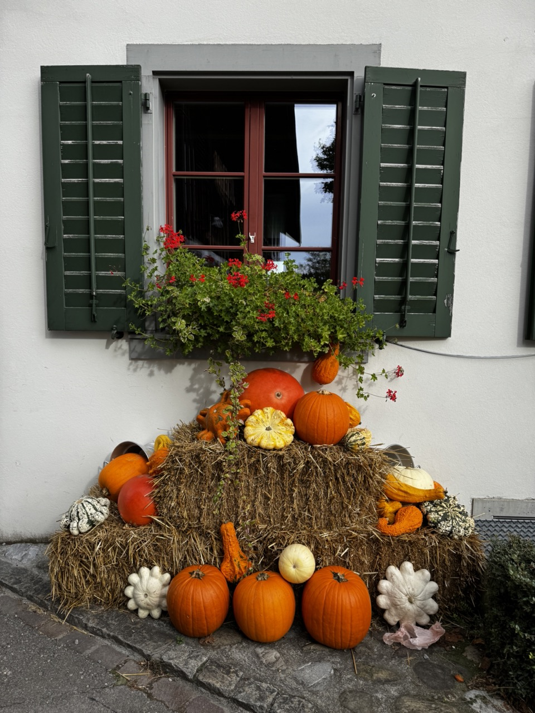
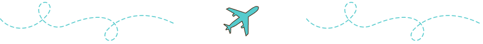

**Jucker Farm** is a family-run farm located in Seegräben, **near Zurich**, known for its agricultural tourism. The farm is famous for its seasonal festivals, including the annual Pumpkin Festival.

It’s a popular destination for families, school groups, and tourists due to its combination of farming, education, and fun.

&nbsp;

Enjoy every single moment at the festival; you will fall in love.

## ✈ Jucker Farm

It is a farm located near **Zurich** where you can enjoy the pumpkin festival.

There are other places where you can find this festival, but this farm is the best option to reach by train.

&nbsp;

[Jucker Farm](https://maps.app.goo.gl/ejZR6iaY6u87948s5)

Mon-Fri: CHF 10 online and CHF 12 on site
Weekend: CHF 12 online and CHF 15 on site

9:30 AM to 5:00 PM

&nbsp;

### ✈ The theme for 2024 is cinema

Every year, there is a theme for the pumpkin exhibition, and it was great to see what they can do with pumpkins.

&nbsp;

<!--  -->

<!--  -->
<!--  -->

<!--  -->

➽ **How to get there**

**By Train** You can take the train from Zurich to Aathal. It takes around 26 minutes to which you should add a 20 minutes walk from Aathal station to the Jucker Farm.

**By Car** It takes around 30min by car to get to the farm. However, the parking space is quite limited and it might be difficult to find space.

&nbsp;

### ✈ The place is very interactive and very worthwhile

&nbsp;

This event is a unique autumn celebration and a great opportunity to enjoy impressive pumpkin sculptures, delicious food, and fun family activities in a picturesque setting near Zurich. 🙃

&nbsp;

&nbsp;

###### ✈ More About Switzerland

🙏🏾 **Religion**: The majority of people living in Switzerland are Christians. 34.4 % are Roman Catholic, and 22.5 % Protestant. There are also many other religions represented in Switzerland: 5.4 % Muslim, 2.6 % Orthodox Christians, 0.5 % Buddhist, 0.2% Jewish.

🗣️ **Language**: English, German, French, Italian and Romansh

🤑 **Currency**: Swiss franc (CHF)

&nbsp;

<!-- 

💡 **Travel Tip**:
_See here if you need [luggage storage in Manchester](https://www.nannybag.com/en)._

 -->

&nbsp;

<iframe src="https://www.google.com/maps/d/u/0/embed?mid=11AxkLq6wX0Z3nJITpgNjrG-b1UGizyw&ehbc=2E312F" width="640" height="480"></iframe>

&nbsp;

<!-- 
&nbsp; -->

<!-- 

 <iframe width="500" height="280" src="https://www.youtube.com/embed/hGnhguLgGe0?si=4Nzoz6g1N3Ntj3C_" title="YouTube video player" frameborder="0" allow="accelerometer; autoplay; clipboard-write; encrypted-media; gyroscope; picture-in-picture; web-share" allowfullscreen></iframe>

 -->

&nbsp;

###### ✈ Tours I recommend

Powered by <a target="_blank" rel="sponsored" href="https://www.getyourguide.com/zurich-l55/">GetYourGuide</a>

&nbsp;

&nbsp;
